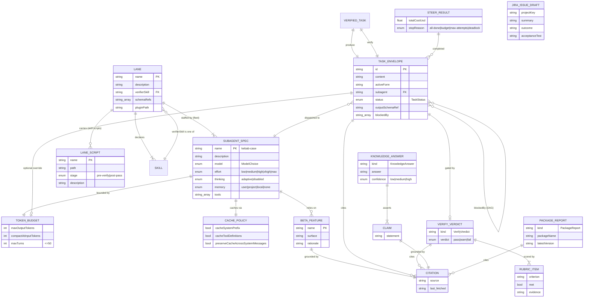
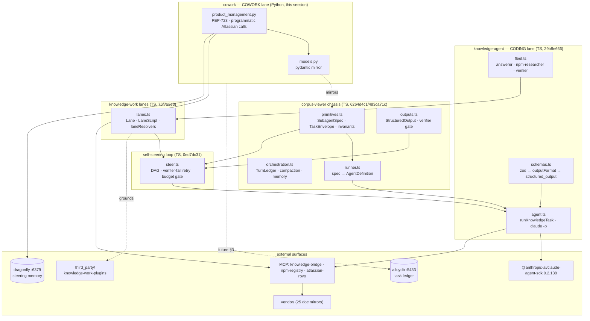

# knowledge-engineering — architecture ERD + multi-session component map

> Design-as-code (the figma/canva-equivalent, in Mermaid so it lives in git and
> renders on GitHub). Two diagrams: (1) the **entity-relationship diagram** of
> the data models that ARE the architecture's contract — implemented in BOTH
> TypeScript (zod) and Python (pydantic); (2) a **C4 component map** of the
> multi-session agent architecture committed to this repo in the trailing 24h.
>
> The data models are the shared contract: `src/agent/corpus-viewer/primitives.ts`
> + `knowledge-agent/{schemas,lanes}.ts` (zod) and `src/agent/cowork/models.py`
> (pydantic) implement the SAME entities. Drift between them is a bug.

---

## 1. Entity-relationship diagram (the data contract)

### Enums (closed value sets, identical across zod + pydantic)

| Enum | Values | Owner |
| ---- | ------ | ----- |
| `ModelChoice` | opus, sonnet, haiku, inherit, claude-opus-4-8, claude-haiku-4-5-20251001 | SubagentSpec.model |
| `Effort` | low, medium, high, xhigh, max | SubagentSpec.effort |
| `Thinking` | adaptive, disabled | SubagentSpec.thinking |
| `MemoryScope` | user, project, local, none | SubagentSpec.memory |
| `TaskStatus` | pending, in_progress, done, failed, compacted | TaskEnvelope.status |
| `Verdict` | pass, warn, fail | VerifyVerdict.verdict |
| `ScriptStage` | pre-verify, post-pass | LaneScript.stage |

### Two implementations, one contract

| Entity | TypeScript (zod) | Python (pydantic) |
| ------ | ---------------- | ----------------- |
| SubagentSpec, TokenBudget, CachePolicy, Citation, BetaFeature, TaskEnvelope | `src/agent/corpus-viewer/primitives.ts` | `src/agent/cowork/models.py` |
| KnowledgeAnswer, PackageReport, VerifyVerdict | `src/agent/knowledge-agent/schemas.ts` | `models.py` (VerifyVerdict; others as needed) |
| Lane, LaneScript | `src/agent/knowledge-agent/lanes.ts` | `models.py` |
| JiraIssueDraft (cowork) | — (Python-only) | `models.py` |

---

## 2. Multi-session component map (24h architecture)

The agent architecture committed in the trailing 24h, lane = CODING (TypeScript)
vs COWORK (Python). Built across multiple sessions, all on
`feat/sitemap-mirror-lsp-pdf-tooling` (commits `6264d4c1` → present).

### Session lineage (24h, all `alex-jadecli`)

| Commit | What | Lane |
| ------ | ---- | ---- |
| `6264d4c1` | docker + apple-docc vendor mirrors, DocC renderer | infra |
| `483ca71c` | corpus-viewer subagent build chassis | TS coding |
| `29b8e666` | claude-knowledge-agent (Zod-type-safe claude -p) | TS coding |
| `b0662e17` | src/agent test discovery + commonmark anchor | test |
| `cc0ae1c5` | vendor refresh + prettier-normalize | infra |
| `0ed7dc31` | steerKnowledgeLoop (DAG + verifier-fail retry + budget) | TS coding |
| `d14b3e35` | self-steering abstraction design | docs |
| `76f712e3` | knowledge-work Lane abstraction + skill-scripts | TS coding |
| `f5f4e564` | ground §2 in real knowledge-work-plugins | docs |
| _this session_ | Python cowork lane + this ERD | Python cowork |

---

## 3. The lane split (operator's differentiation ask)

| | CODING lane | COWORK lane |
| --- | ----------- | ----------- |
| Language | TypeScript | Python |
| Typing | zod | pydantic |
| Runtime | `claude -p` via Agent SDK `query()` | programmatic MCP tool calling |
| Packaging | npm module (tsc build) | PEP-723 self-contained script (`uv run`) |
| Example | knowledge-answerer reviews code | product_management.py drafts Jira tasks via atlassian-rovo |
| Verifier | model-verifier (VerifyVerdict) + pre-verify scripts | same contract, MCP-side |
| Memory | in-process TurnLedger | dragonfly :6379 (durable, cross-session) |

Both lanes implement the same ERD. The loop (`steer.ts`) is lane-agnostic — a
Python cowork DAG and a TS coding DAG share state through dragonfly/alloydb, not
through either process. That is the cross-language self-steering substrate.

---

## Citations

- `src/agent/corpus-viewer/primitives.ts` — zod SubagentSpec/TaskEnvelope/budgets
- `src/agent/knowledge-agent/{schemas,lanes,steer}.ts` — zod outputs + lanes + loop
- `src/agent/cowork/{models.py,product_management.py}` — pydantic mirror + cowork script
- `docs/reference/self-steering-abstraction.md` — the §1–§4 roadmap
- `vendor/anthropics/code.claude.com/docs/en/agent-sdk/subagents.md` — AgentDefinition surface
- ground truth: `third_party/anthropics-knowledge-work-plugins/` (gitignored clone)
