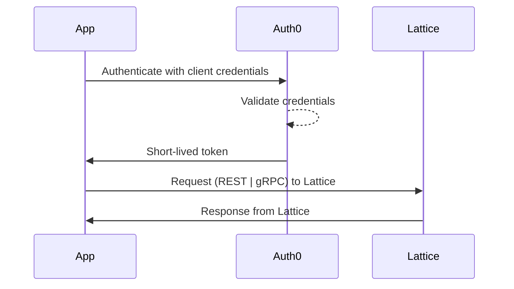
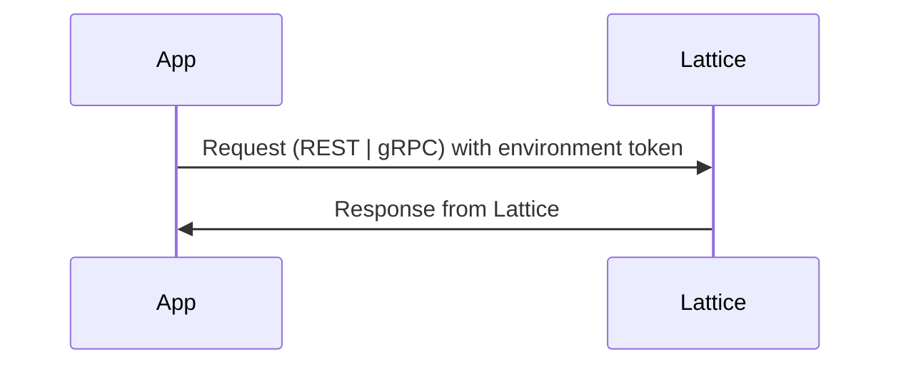

> For clean Markdown of any page, append .md to the page URL.
> For a complete documentation index, see https://developer.anduril.com/llms.txt.
> For AI client integration (Claude Code, Cursor, etc.), connect to the MCP server at https://developer.anduril.com/_mcp/server.

# Authenticate

Lattice supports two authentication methods: OAuth 2.0 **client credentials** using short-lived access token,
**environment token** authentication, using long-lived, static access tokens.

OAuth 2.0 client credentials exchange a client ID and secret for a short-lived token.
REST SDKs manage the client credential lifecycle automatically, while gRPC integrations require that you refresh the token:



Environment tokens are set to be deprecated. We recommend only using this method if the Lattice environment
you are connecting to does not currently support client credentials.

The environment token method uses a long-lived, static token. You must ensure to rotate the token before it expires:



The following steps show how to authenticate using both client credentials and long-lived environment tokens with both REST and gRPC SDKs.

## Before you begin

* [Set up](/guides/getting-started/set-up) the Lattice SDK.
* If you are using Lattice Sandboxes, see [the Sandboxes set up guide](/guides/developer-tools/sandboxes).
  If you are using a Lattice deployment other than Sandboxes, obtain your Lattice endpoint and access credentials from your
  Anduril representative.

## Get the Lattice endpoint

To store the Lattice endpoint as a system environment variable, do the following:

Add a system variable for your Lattice environment endpoint (hostname only):

```bash title="Bash"
export LATTICE_ENDPOINT=<YOUR_LATTICE_ENDPOINT>
```

```ps title="Powershell" 
setx LATTICE_ENDPOINT <YOUR_LATTICE_ENDPOINT>
```

To verify, run the following command to print the system environment variables to your terminal:

```bash title="Bash"
echo $LATTICE_ENDPOINT
<environment_id>.env.sandboxes.developer.anduril.com
```

```ps title="PowerShell"
$env:LATTICE_ENDPOINT
<environment_id>.env.sandboxes.developer.anduril.com
```

## Get your credentials

To store your credentials as system environment variables, do the following:

If you're using client credentials:

```bash title="Bash"
export LATTICE_CLIENT_ID=<YOUR_LATTICE_CLIENT_ID>
export LATTICE_CLIENT_SECRET=<YOUR_LATTICE_CLIENT_SECRET>
```

```ps title="Powershell"
setx LATTICE_CLIENT_ID <YOUR_LATTICE_CLIENT_ID>
setx LATTICE_CLIENT_SECRET <YOUR_LATTICE_CLIENT_SECRET>
```

If you're using a long-lived environment token:

```bash title="Bash"
export ENVIRONMENT_TOKEN=<YOUR_ENVIRONMENT_TOKEN>
```

```ps title="Powershell"
setx ENVIRONMENT_TOKEN <YOUR_ENVIRONMENT_TOKEN>
```

If you're connecting to Sandboxes:

```bash title="Bash"
export SANDBOXES_TOKEN=<YOUR_SANDBOXES_TOKEN>
```

```ps title="PowerShell"
setx SANDBOXES_TOKEN <YOUR_SANDBOXES_TOKEN>
```

This is required for Sandboxes whether
you use client credentials, or an environment token. If you do not have a Sandboxes token,
[create a new token](/guides/developer-tools/sandboxes#set-up-credentials).

## Client credentials

OAuth 2.0 client credentials is the recommended authentication method for production integrations.
When you use OAuth, Lattice exchanges your credentials for a short-lived access token using the
[Lattice OAuth](/reference/rest/oauth/get-token) REST endpoint:

### Using REST

The REST SDK handles fetching a new access token automatically.
Pass your client ID and secret when you initialize the client:

```go title={"Go (REST)"} startLine={1} maxLines={15}
package main

import (
	"context"
	"fmt"
	"net/http"
	"os"
	"time"

	Lattice "github.com/anduril/lattice-sdk-go/v4"
	"github.com/anduril/lattice-sdk-go/v4/client"
	"github.com/anduril/lattice-sdk-go/v4/option"
)

func main() {
	// Get environment variables
	latticeEndpoint := os.Getenv("LATTICE_ENDPOINT")
	clientSecret := os.Getenv("LATTICE_CLIENT_SECRET")
	clientId := os.Getenv("LATTICE_CLIENT_ID")

	// Remove sandboxesToken from the following statements if you are not developing on Sandboxes.
	sandboxesToken := os.Getenv("SANDBOXES_TOKEN")

	// Check required environment variables
	if latticeEndpoint == "" || clientId == "" || clientSecret == "" || sandboxesToken == "" {
		fmt.Println("Missing required environment variables")
		os.Exit(1)
	}

	// Initialize headers for sandbox authorization
	headers := http.Header{}
	headers.Add("Anduril-Sandbox-Authorization", fmt.Sprintf("Bearer %s", sandboxesToken))

	// Create the client
	LatticeClient := client.NewClient(
		option.WithClientCredentials(clientId, clientSecret),
		option.WithBaseURL(fmt.Sprintf("https://%s", latticeEndpoint)),
		option.WithHTTPHeader(headers),
	)

	// Continuously get the entity
	for {
		// Create context for the request
		ctx := context.Background()

		entity, err := LatticeClient.Entities.GetEntity(
			ctx,
			&Lattice.GetEntityRequest{
				EntityID: "<ENTITY_ID>",
			},
		)

		if err != nil {
			fmt.Printf("Error fetching entity: %v\n", err)
		} else {
			fmt.Printf("Asset name     | %s\n", *entity.GetAliases().GetName())
			fmt.Printf("Asset location | %f, %f\n", *entity.GetLocation().GetPosition().GetLatitudeDegrees(),
				*entity.GetLocation().GetPosition().GetLongitudeDegrees())
		}

		// Wait before next request
		time.Sleep(5 * time.Second)
	}
}

```

```java title={"Java (REST)"} startLine={1} maxLines={15}
package org.example;
import com.anduril.Lattice;
import com.anduril.types.Entity;
import java.time.LocalDateTime;

/**
 * Example application that tracks an entity's location using the Lattice SDK.
 */
public class GetEntity {
    private static final String ENTITY_ID = "<ENTITY_ID>";
    
    public static void main(String[] args) {
        // Get environment variables
        String endpoint = System.getenv("LATTICE_ENDPOINT");
        String clientId = System.getenv("LATTICE_CLIENT_ID");
        String clientSecret = System.getenv("LATTICE_CLIENT_SECRET");
        String sandboxesToken = System.getenv("SANDBOXES_TOKEN");
        
        // Check required variables and ensure URL has https://
        if (endpoint == null || clientId == null || clientSecret == null || sandboxesToken == null) {
            System.err.println("Missing required environment variables");
            System.exit(1);
        }
        if (!endpoint.startsWith("https://")) endpoint = "https://" + endpoint;
        
        try {
            // Create Lattice client with Sandbox authentication
            Lattice client = Lattice.builder()
                .url(endpoint)
                .credentials(clientId, clientSecret)
                .addHeader("Anduril-Sandbox-Authorization", "Bearer " + sandboxesToken)
                .build();
            
            // Poll for entity location
            while (true) {
                try {
                    Entity entity = client.entities().getEntity(ENTITY_ID);
                    
                    System.out.println("Timestamp: " + LocalDateTime.now());
                    System.out.println("Asset name: " + entity.getAliases());
                    if (entity.getLocation() != null) {
                        System.out.println("Location: " + entity.getLocation());
                    }
                    System.out.println("---------------");
                    
                    Thread.sleep(5000);
                } catch (Exception e) {
                    System.err.println("Error: " + e.getMessage());
                    Thread.sleep(10000);
                }
            }
        } catch (Exception e) {
            System.err.println("Failed to initialize: " + e.getMessage());
        }
    }
}
```

```py title={"Python (REST)"} startLine={1} maxLines={15}
from anduril import Lattice
import asyncio
import os
import sys

lattice_endpoint = os.getenv('LATTICE_ENDPOINT')
client_id = os.getenv('LATTICE_CLIENT_ID')
client_secret = os.getenv('LATTICE_CLIENT_SECRET')

# Remove sandboxes_token from the following statements if you are not developing on Sandboxes.
sandboxes_token = os.getenv('SANDBOXES_TOKEN')
if not client_id or not client_secret or not lattice_endpoint or not sandboxes_token:
    print("Missing required environment variables.")
    sys.exit(1)

client = Lattice(
    # Set your environment endpoint.
    base_url=f"https://{lattice_endpoint}",
    client_id=client_id,
    client_secret=client_secret,
    # Remove the header if you are not developing on Sandboxes.
    headers={ "anduril-sandbox-authorization": f"Bearer {sandboxes_token}" }
)
async def app(entity_id):
    try:
        while(True):
            entity = client.entities.get_entity(
                entity_id=entity_id
            )
            
            if entity.aliases:
                print(f"Asset name     | {entity.aliases.name}")
            if entity.location and entity.location.position:
                print(f"Asset location | {entity.location.position.latitude_degrees}, {entity.location.position.longitude_degrees}")

            await asyncio.sleep(5)

    except (asyncio.CancelledError, KeyboardInterrupt):
        print(">>>Exiting...")
    except Exception as error:
        print(f"Exception: {error}")

if __name__ == "__main__":
    asyncio.run(app("<ENTITY_ID>"))
```

```ts title={"TypeScript (REST)"} startLine={1} maxLines={15}
import { LatticeClient } from "@anduril-industries/lattice-sdk";

const latticeEndpoint = process.env.LATTICE_ENDPOINT;
const clientSecret = process.env.LATTICE_CLIENT_SECRET;
const clientId = process.env.LATTICE_CLIENT_ID;

// Remove sandboxesToken from the following statement if you are not developing on Sandboxes.
const sandboxesToken = process.env.SANDBOXES_TOKEN;
if (!latticeEndpoint || !clientId || !clientSecret || !sandboxesToken) {
    console.log('Missing required environment variables.');
    process.exit(1);
}
const client = new LatticeClient(
    {
        baseUrl: `https://${latticeEndpoint}`,
        clientId: clientId,
        clientSecret: clientSecret,
        // Remove the following statement if you are not developing on Sandboxes.
        headers: {  "Anduril-Sandbox-Authorization": `Bearer ${sandboxesToken}` }
    }
);

async function App(entityId: string) {
    try {
        // Fetch the entity using the client.
        const entity = await client.entities.getEntity({ entityId });

        // Check if the entity object is not empty
        if (entity && Object.keys(entity).length > 0) {
            console.log(`Asset name     | ${entity.aliases?.name}`);
            console.log(`Asset location | ${entity.location?.position?.latitudeDegrees}, ${entity.location?.position?.longitudeDegrees}`);
        } else {
            console.log('Entity object is empty.');
        }
    } catch (error) {
        console.log(`Encountered the following error while fetching entity: ${error}`);
    }
}

(async function runIndefinitely() {
    while (true) {
        // Replace <ENTITY_ID> with the entity ID of the entity you want to get.
        await App("<ENTITY_ID>");
        await new Promise(resolve => setTimeout(resolve, 1000));
    }
})();
```

### Using gRPC

Since gRPC does not provide built-in OAuth token management, implement a `ClientCredentialsAuth`
module that fetches an access token, caches it, and refreshes it before it expires:

```go title={"Go (gRPC)"} startLine={16} maxLines={15}
// This Go example is compatible with artifacts generated using
// the following grpc/go plugin: https://buf.build/anduril/lattice-sdk/sdks/main:grpc/go
package main

import (
	"context"
	"encoding/json"
	"fmt"
	"io"
	"net/http"
	"net/url"
	"strings"
	"time"
)

type ClientCredentialsAuth struct {
	ClientID       string
	ClientSecret   string
	SandboxesToken string
	Endpoint       string
}

type TokenResponse struct {
	AccessToken string `json:"access_token"`
	ExpiresIn   int    `json:"expires_in"`
	TokenType   string `json:"token_type"`
}

var (
	tokenCache      TokenResponse
	tokenExpiryTime time.Time
)

func GetToken(credentials *ClientCredentialsAuth) (*TokenResponse, error) {
	// If the token is initialized and doesn't expire within the next 5 minutes, return it.
	if tokenCache.AccessToken != "" && time.Now().Add(time.Minute*5).Before(tokenExpiryTime) {
		return &tokenCache, nil
	}

	// Otherwise, refresh the token

	formData := url.Values{}
	formData.Add("grant_type", "client_credentials")
	formData.Add("client_id", credentials.ClientID)
	formData.Add("client_secret", credentials.ClientSecret)

	req, err := http.NewRequest("POST", credentials.Endpoint, strings.NewReader(formData.Encode()))
	if err != nil {
		return nil, fmt.Errorf("failed to create token request: %w", err)
	}
	req.Header.Add("Anduril-Sandbox-Authorization", "Bearer "+credentials.SandboxesToken)
	req.Header.Add("Content-Type", "application/x-www-form-urlencoded")

	client := &http.Client{
		Timeout: 10 * time.Second, // Set a timeout for the HTTP request
	}

	resp, err := client.Do(req)
	if err != nil {
		return nil, fmt.Errorf("failed to make token request: %w", err)
	}
	defer resp.Body.Close()

	if resp.StatusCode != http.StatusOK {
		bodyBytes, _ := io.ReadAll(resp.Body)
		return nil, fmt.Errorf("token request failed with status %d: %s", resp.StatusCode, string(bodyBytes))
	}

	var tokenResp TokenResponse
	if err := json.NewDecoder(resp.Body).Decode(&tokenResp); err != nil {
		return nil, fmt.Errorf("failed to decode token response: %w", err)
	}

	// Cache the token and set its expiry time
	tokenCache = tokenResp
	tokenExpiryTime = time.Now().Add(time.Duration(tokenResp.ExpiresIn) * time.Second)

	return &tokenCache, nil
}

func (a *ClientCredentialsAuth) GetRequestMetadata(ctx context.Context, uri ...string) (map[string]string, error) {
	_, err := GetToken(a)
	if err != nil {
		fmt.Printf("Token refresh failed: %v\n", err)
		return nil, err
	}
	headers := map[string]string{
		"authorization":                 "Bearer " + tokenCache.AccessToken,
		"anduril-sandbox-authorization": "Bearer " + a.SandboxesToken,
	}
	return headers, nil
}

func (b *ClientCredentialsAuth) RequireTransportSecurity() bool {
	return true
}

```

```py title={"Python (gRPC)"} startLine={18} maxLines={15}
# This Python example is compatible with artifacts generated using
# the following grpc/python plugin: https://buf.build/anduril/lattice-sdk/sdks/main:grpc/python
import time
from typing import Optional
import requests
import grpc


class TokenResponse:
    """Represents an OAuth token response."""

    def __init__(self, access_token: str, expires_in: int):
        self.access_token = access_token
        self.expires_in = expires_in


class ClientCredentialsAuth:
    """
    Handles OAuth 2.0 client credentials authentication with token caching
    and automatic refresh.
    """

    def __init__(
        self,
        client_id: str,
        client_secret: str,
        sandboxes_token: str,
        endpoint: str
    ):
        self.client_id = client_id
        self.client_secret = client_secret
        self.sandboxes_token = sandboxes_token
        self.endpoint = endpoint
        self.token_cache: Optional[TokenResponse] = None
        self.token_expiry_time: float = 0

    def get_token(self) -> TokenResponse:
        """
        Gets a valid access token, fetching a new one if the cached token
        is expired or about to expire (within 5 minutes).
        """
        now = time.time()

        # If the token is valid and doesn't expire within the next 5 minutes, return it
        if self.token_cache and now + 300 < self.token_expiry_time:
            return self.token_cache

        # Otherwise, refresh the token
        form_data = {
            "grant_type": "client_credentials",
            "client_id": self.client_id,
            "client_secret": self.client_secret,
        }

        headers = {
            "Content-Type": "application/x-www-form-urlencoded",
            "Anduril-Sandbox-Authorization": f"Bearer {self.sandboxes_token}",
        }

        response = requests.post(self.endpoint, data=form_data, headers=headers)

        if not response.ok:
            raise Exception(
                f"Token request failed with status {response.status_code}: {response.text}"
            )

        token_data = response.json()
        self.token_cache = TokenResponse(
            access_token=token_data["access_token"],
            expires_in=token_data["expires_in"]
        )
        self.token_expiry_time = now + self.token_cache.expires_in

        return self.token_cache

    def create_metadata_interceptor(self) -> grpc.UnaryUnaryClientInterceptor:
        """
        Creates a gRPC interceptor that adds authentication headers
        to all outgoing requests.
        """
        return AuthInterceptor(self)


class AuthInterceptor(
    grpc.UnaryUnaryClientInterceptor,
    grpc.UnaryStreamClientInterceptor,
    grpc.StreamUnaryClientInterceptor,
    grpc.StreamStreamClientInterceptor,
):
    """gRPC interceptor that adds authentication headers to all RPC types."""

    def __init__(self, auth: ClientCredentialsAuth):
        self.auth = auth

    def _augment_call_details(self, client_call_details):
        token = self.auth.get_token()

        metadata = []
        if client_call_details.metadata is not None:
            metadata = list(client_call_details.metadata)

        metadata.append(("authorization", f"Bearer {token.access_token}"))
        metadata.append(("anduril-sandbox-authorization", f"Bearer {self.auth.sandboxes_token}"))

        return grpc._interceptor._ClientCallDetails(
            client_call_details.method,
            client_call_details.timeout,
            tuple(metadata),
            client_call_details.credentials,
            client_call_details.wait_for_ready,
            client_call_details.compression,
        )

    def intercept_unary_unary(self, continuation, client_call_details, request):
        return continuation(self._augment_call_details(client_call_details), request)

    def intercept_unary_stream(self, continuation, client_call_details, request):
        return continuation(self._augment_call_details(client_call_details), request)

    def intercept_stream_unary(self, continuation, client_call_details, request_iterator):
        return continuation(self._augment_call_details(client_call_details), request_iterator)

    def intercept_stream_stream(self, continuation, client_call_details, request_iterator):
        return continuation(self._augment_call_details(client_call_details), request_iterator)
```

```rs title={"Rust (gRPC)"} startLine={13} maxLines={15}
// This Rust example is compatible with artifacts generated using
// the following grpc/rust plugin: https://buf.build/anduril/lattice-sdk/sdks/main:community/neoeinstein-tonic
use anyhow::{Context, Result};
use reqwest::Client;
use serde::Deserialize;
use std::sync::{Arc, RwLock};
use std::time::{Duration, SystemTime};

#[derive(Debug, Deserialize)]
struct TokenResponse {
    access_token: String,
    expires_in: u64,
}

#[derive(Clone)]
pub struct ClientCredentialsAuth {
    client_id: String,
    client_secret: String,
    sandboxes_token: String,
    endpoint: String,
    token_cache: Arc<RwLock<Option<CachedToken>>>,
    http_client: Client,
}

#[derive(Clone)]
struct CachedToken {
    access_token: String,
    expires_at: SystemTime,
}

impl ClientCredentialsAuth {
    pub fn new(
        client_id: String,
        client_secret: String,
        sandboxes_token: String,
        endpoint: String,
    ) -> Self {
        Self {
            client_id,
            client_secret,
            sandboxes_token,
            endpoint,
            token_cache: Arc::new(RwLock::new(None)),
            http_client: Client::new(),
        }
    }

    async fn fetch_token(&self) -> Result<TokenResponse> {
        let params = [
            ("grant_type", "client_credentials"),
            ("client_id", &self.client_id),
            ("client_secret", &self.client_secret),
        ];

        let response = self
            .http_client
            .post(&self.endpoint)
            .header("anduril-sandbox-authorization", format!("Bearer {}", self.sandboxes_token))
            .form(&params)
            .send()
            .await
            .context("Failed to send token request")?;

        if !response.status().is_success() {
            let status = response.status();
            let body = response.text().await.unwrap_or_default();
            anyhow::bail!("Token request failed with status {}: {}", status, body);
        }

        response
            .json::<TokenResponse>()
            .await
            .context("Failed to parse token response")
    }

    pub async fn get_token(&self) -> Result<String> {
        // Check if we have a valid cached token
        {
            let cache = self.token_cache.read().unwrap();
            if let Some(cached) = &*cache {
                if cached.expires_at > SystemTime::now() {
                    return Ok(cached.access_token.clone());
                }
            }
        }

        // Fetch new token
        let token_response = self.fetch_token().await?;

        // Cache the token with a buffer before expiration
        let expires_at = SystemTime::now() + Duration::from_secs(token_response.expires_in - 60);
        let cached_token = CachedToken {
            access_token: token_response.access_token.clone(),
            expires_at,
        };

        {
            let mut cache = self.token_cache.write().unwrap();
            *cache = Some(cached_token);
        }

        Ok(token_response.access_token)
    }

    pub fn sandboxes_token(&self) -> &str {
        &self.sandboxes_token
    }
}

```

Then, use this module to handle fetching new tokens when you interact with Lattice:

```go title={"Go (gRPC)"} startLine={28} maxLines={15}
// This Go example is compatible with artifacts generated using
// the following grpc/go plugin: https://buf.build/anduril/lattice-sdk/sdks/main:grpc/go
package main

import (
	"context"
	"fmt"
	"log"
	"os"
	"time"

	"buf.build/gen/go/anduril/lattice-sdk/grpc/go/anduril/entitymanager/v1/entitymanagerv1grpc"
	entitymanagerv1 "buf.build/gen/go/anduril/lattice-sdk/protocolbuffers/go/anduril/entitymanager/v1"
	"google.golang.org/grpc"
	"google.golang.org/grpc/credentials"
)

func main() {
	ctx := context.Background()

	clientID := os.Getenv("LATTICE_CLIENT_ID")
	clientSecret := os.Getenv("LATTICE_CLIENT_SECRET")
	latticeEndpoint := os.Getenv("LATTICE_ENDPOINT")
	sandboxesToken := os.Getenv("SANDBOXES_TOKEN")

	if latticeEndpoint == "" || clientSecret == "" || clientID == "" || sandboxesToken == "" {
		log.Fatalf("Missing required environment variables")
	}
	auth := &ClientCredentialsAuth{
		ClientID:       clientID,
		ClientSecret:   clientSecret,
		SandboxesToken: sandboxesToken,
		Endpoint:       fmt.Sprintf("https://%s/api/v1/oauth/token", latticeEndpoint),
	}

	opts := []grpc.DialOption{
		grpc.WithTransportCredentials(credentials.NewClientTLSFromCert(nil, "")),
		grpc.WithPerRPCCredentials(auth),
	}
	conn, err := grpc.NewClient(latticeEndpoint, opts...)

	if err != nil {
		log.Fatalf("Did not connect: %v", err)
	}
	defer conn.Close()

	client := entitymanagerv1grpc.NewEntityManagerAPIClient(conn)

	// Periodically get the latest entity state
	for {
		entity, err := client.GetEntity(ctx, &entitymanagerv1.GetEntityRequest{
			EntityId: "Demo-Sim-Asset1",
		})
		if err != nil {
			log.Fatalf("Error getting entity: %v", err)
		}

		// Process each entity.
		log.Printf("Fetching entity at location: %f %f", entity.GetEntity().GetLocation().GetPosition().LatitudeDegrees, entity.GetEntity().GetLocation().GetPosition().LongitudeDegrees)

		time.Sleep(5 * time.Second)
	}
}

```

```py title={"Python (gRPC)"} startLine={24} maxLines={15}
# This Python example is compatible with artifacts generated using
# the following grpc/python plugin: https://buf.build/anduril/lattice-sdk/sdks/main:grpc/python

import os
import sys
import time
import grpc
from auth import ClientCredentialsAuth

from anduril.entitymanager.v1.entity_manager_api.pub_pb2 import GetEntityRequest
from anduril.entitymanager.v1.entity_manager_api.pub_pb2_grpc import EntityManagerAPIStub


def main():
    # Load environment variables
    client_id = os.getenv("LATTICE_CLIENT_ID")
    client_secret = os.getenv("LATTICE_CLIENT_SECRET")
    lattice_endpoint = os.getenv("LATTICE_ENDPOINT")
    sandboxes_token = os.getenv("SANDBOXES_TOKEN")

    if not client_id or not client_secret or not lattice_endpoint or not sandboxes_token:
        print("Missing required environment variables", file=sys.stderr)
        sys.exit(1)

    # Create authentication handler
    auth = ClientCredentialsAuth(
        client_id=client_id,
        client_secret=client_secret,
        sandboxes_token=sandboxes_token,
        endpoint=f"https://{lattice_endpoint}/api/v1/oauth/token"
    )

    # Create gRPC channel with SSL and authentication interceptor
    credentials = grpc.ssl_channel_credentials()
    channel = grpc.intercept_channel(
        grpc.secure_channel(lattice_endpoint, credentials),
        auth.create_metadata_interceptor()
    )

    # Create EntityManager API client stub
    client = EntityManagerAPIStub(channel)

    # Periodically get the latest entity state
    while True:
        try:
            request = GetEntityRequest(entity_id="<ENTITY_ID>")

            # Call the GetEntity RPC
            response = client.GetEntity(request)

            # Log entity location if available
            if (
                response.entity
                and response.entity.location
                and response.entity.location.position
            ):
                position = response.entity.location.position
                print(
                    f"Fetching entity at location: "
                    f"{position.latitude_degrees} {position.longitude_degrees}"
                )

        except Exception as error:
            print(f"Error getting entity: {error}", file=sys.stderr)

        time.sleep(5)


if __name__ == "__main__":
    main()

```

```rs title={"Rust (gRPC)"} startLine={69} maxLines={15}
// This Rust example is compatible with artifacts generated using
// the following grpc/rust plugin: https://buf.build/anduril/lattice-sdk/sdks/main:community/neoeinstein-tonic
mod auth;

use anduril_lattice_sdk_community_neoeinstein_tonic::anduril::entitymanager::v1::tonic::entity_manager_api_client::EntityManagerApiClient;
use anduril_lattice_sdk_community_neoeinstein_prost::anduril::entitymanager::v1::GetEntityRequest;
use auth::ClientCredentialsAuth;
use tonic::metadata::MetadataValue;
use tonic::transport::{Channel, ClientTlsConfig};
use tonic::Request;

use std::env;
use std::time::Duration;

/// Main application entry point
#[tokio::main]
async fn main() -> Result<(), Box<dyn std::error::Error>> {
    // Load environment variables
    let client_id = env::var("LATTICE_CLIENT_ID")
        .expect("LATTICE_CLIENT_ID environment variable not set");
    let client_secret = env::var("LATTICE_CLIENT_SECRET")
        .expect("LATTICE_CLIENT_SECRET environment variable not set");
    let lattice_endpoint = env::var("LATTICE_ENDPOINT")
        .expect("LATTICE_ENDPOINT environment variable not set");
    let sandboxes_token = env::var("SANDBOXES_TOKEN")
        .expect("SANDBOXES_TOKEN environment variable not set");

    // Validate required environment variables
    if client_id.is_empty() || client_secret.is_empty() || lattice_endpoint.is_empty() || sandboxes_token.is_empty() {
        eprintln!("Missing required environment variables:");
        eprintln!("  LATTICE_CLIENT_ID");
        eprintln!("  LATTICE_CLIENT_SECRET");
        eprintln!("  LATTICE_ENDPOINT");
        eprintln!("  SANDBOXES_TOKEN");
        std::process::exit(1);
    }

    // Create authentication handler
    let auth = ClientCredentialsAuth::new(
        client_id,
        client_secret,
        sandboxes_token.clone(),
        format!("https://{}/api/v1/oauth/token", lattice_endpoint),
    );

    // Create gRPC channel with TLS
    let tls_config = ClientTlsConfig::new().with_native_roots();
    let channel = Channel::from_shared(format!("https://{}", lattice_endpoint))?
        .tls_config(tls_config)?
        .connect()
        .await?;

    println!("Starting EntityManager API client...");
    println!("Connected to: {}", lattice_endpoint);
    println!();

    // Periodically get the latest entity state
    loop {
        match get_entity(&auth, channel.clone()).await {
            Ok(_) => {}
            Err(e) => {
                eprintln!("Error getting entity: {}", e);
            }
        }

        // Wait 5 seconds before next request
        tokio::time::sleep(Duration::from_secs(5)).await;
    }
}

async fn get_entity(
    auth: &ClientCredentialsAuth,
    channel: Channel,
) -> Result<(), Box<dyn std::error::Error>> {
    // Get fresh access token
    let access_token = auth.get_token().await?;
    let sandboxes_token = auth.sandboxes_token();

    // Parse tokens into metadata values
    let auth_header: MetadataValue<_> = format!("Bearer {}", access_token).parse()?;
    let sandbox_header: MetadataValue<_> = format!("Bearer {}", sandboxes_token).parse()?;

    // Create EntityManager API client with authentication interceptor
    let mut client = EntityManagerApiClient::with_interceptor(
        channel,
        move |mut req: Request<()>| {
            req.metadata_mut()
                .insert("authorization", auth_header.clone());
            req.metadata_mut()
                .insert("anduril-sandbox-authorization", sandbox_header.clone());
            Ok(req)
        },
    );

    // Create request for a specific entity
    let request = Request::new(GetEntityRequest {
        entity_id: "<ENTITY_ID>".to_string(),
    });

    // Call the GetEntity RPC
    let response = client.get_entity(request).await?;

    // Log entity location if available
    if let Some(entity) = response.get_ref().entity.as_ref() {
        if let Some(location) = entity.location.as_ref() {
            if let Some(position) = location.position.as_ref() {
                println!(
                    "Fetching entity at location: {} {}",
                    position.latitude_degrees, position.longitude_degrees
                );
            }
        }
    }

    Ok(())
}

```

These examples refresh the access token before it expires (with a buffer of approximately five minutes). Each gRPC call invokes the
helper function, which checks the cache and refreshes the token if needed.

## Environment token

Bearer token authentication uses a long-lived, static token to authenticate requests.
Use this method when your deployment provides a static access token rather than OAuth 2.0 client credentials.

### Using REST

Pass the token directly to the client constructor using the `token` parameter:

```go title={"Go (REST)"} startLine={1} maxLines={15}
package main

import (
	"context"
	"fmt"
	"net/http"
	"os"
	"time"

	Lattice "github.com/anduril/lattice-sdk-go/v4"
	"github.com/anduril/lattice-sdk-go/v4/client"
	"github.com/anduril/lattice-sdk-go/v4/option"
)

func main() {
	latticeEndpoint := os.Getenv("LATTICE_ENDPOINT")
	environmentToken := os.Getenv("ENVIRONMENT_TOKEN")
	// Remove sandboxesToken from the following statements if you are not developing on Sandboxes.
	sandboxesToken := os.Getenv("SANDBOXES_TOKEN")

	if latticeEndpoint == "" || environmentToken == "" || sandboxesToken == "" {
		fmt.Println("Missing required environment variables")
		os.Exit(1)
	}

	headers := http.Header{}
	headers.Add("Anduril-Sandbox-Authorization", fmt.Sprintf("Bearer %s", sandboxesToken))

	LatticeClient := client.NewClient(
		option.WithToken(environmentToken),
		option.WithBaseURL(fmt.Sprintf("https://%s", latticeEndpoint)),
		option.WithHTTPHeader(headers),
	)

	for {
		ctx := context.Background()
		entity, err := LatticeClient.Entities.GetEntity(ctx, &Lattice.GetEntityRequest{EntityID: "<ENTITY_ID>"})
		if err != nil {
			fmt.Printf("Error fetching entity: %v\n", err)
		} else {
			fmt.Printf("Asset name     | %s\n", *entity.GetAliases().GetName())
			fmt.Printf("Asset location | %f, %f\n", *entity.GetLocation().GetPosition().GetLatitudeDegrees(),
				*entity.GetLocation().GetPosition().GetLongitudeDegrees())
		}
		time.Sleep(5 * time.Second)
	}
}

```

```java title={"Java (REST)"} startLine={1} maxLines={15}
package org.example;
import com.anduril.Lattice;
import com.anduril.types.Entity;
import java.time.LocalDateTime;

public class GetEntityEnvToken {
    private static final String ENTITY_ID = "<ENTITY_ID>";

    public static void main(String[] args) {
        String endpoint = System.getenv("LATTICE_ENDPOINT");
        String environmentToken = System.getenv("ENVIRONMENT_TOKEN");
        // Remove sandboxesToken from the following statements if you are not developing on Sandboxes.
        String sandboxesToken = System.getenv("SANDBOXES_TOKEN");

        if (endpoint == null || environmentToken == null || sandboxesToken == null) {
            System.err.println("Missing required environment variables");
            System.exit(1);
        }
        if (!endpoint.startsWith("https://")) endpoint = "https://" + endpoint;

        try {
            Lattice client = Lattice.builder()
                .url(endpoint)
                .token(environmentToken)
                .addHeader("Anduril-Sandbox-Authorization", "Bearer " + sandboxesToken)
                .build();

            while (true) {
                try {
                    Entity entity = client.entities().getEntity(ENTITY_ID);
                    System.out.println("Timestamp: " + LocalDateTime.now());
                    System.out.println("Asset name: " + entity.getAliases());
                    if (entity.getLocation() != null) {
                        System.out.println("Location: " + entity.getLocation());
                    }
                    System.out.println("---------------");
                    Thread.sleep(5000);
                } catch (Exception e) {
                    System.err.println("Error: " + e.getMessage());
                    Thread.sleep(10000);
                }
            }
        } catch (Exception e) {
            System.err.println("Failed to initialize: " + e.getMessage());
        }
    }
}

```

```py title={"Python (REST)"} startLine={1} maxLines={15}
from anduril import Lattice
import asyncio
import os
import sys

lattice_endpoint = os.getenv('LATTICE_ENDPOINT')
environment_token = os.getenv('ENVIRONMENT_TOKEN')

# Remove sandboxes_token from the following statements if you are not developing on Sandboxes.
sandboxes_token = os.getenv('SANDBOXES_TOKEN')
if not environment_token or not lattice_endpoint or not sandboxes_token:
    print("Missing required environment variables.")
    sys.exit(1)

client = Lattice(
    base_url=f"https://{lattice_endpoint}",
    token=lambda: str(environment_token),
    headers={ "anduril-sandbox-authorization": f"Bearer {sandboxes_token}" }
)

async def app(entity_id):
    try:
        while(True):
            entity = client.entities.get_entity(entity_id=entity_id)
            if entity.aliases:
                print(f"Asset name     | {entity.aliases.name}")
            if entity.location and entity.location.position:
                print(f"Asset location | {entity.location.position.latitude_degrees}, {entity.location.position.longitude_degrees}")
            await asyncio.sleep(5)
    except (asyncio.CancelledError, KeyboardInterrupt):
        print(">>>Exiting...")
    except Exception as error:
        print(f"Exception: {error}")

if __name__ == "__main__":
    asyncio.run(app("<ENTITY_ID>"))

```

```ts title={"TypeScript (REST)"} startLine={1} maxLines={15}
import { LatticeClient } from "@anduril-industries/lattice-sdk";

const latticeEndpoint = process.env.LATTICE_ENDPOINT;
const environmentToken = process.env.ENVIRONMENT_TOKEN;
// Remove sandboxesToken from the following statements if you are not developing on Sandboxes.
const sandboxesToken = process.env.SANDBOXES_TOKEN;
if (!latticeEndpoint || !environmentToken || !sandboxesToken) {
    console.log('Missing required environment variables.');
    process.exit(1);
}
const client = new LatticeClient({
    baseUrl: `https://${latticeEndpoint}`,
    token: environmentToken,
    headers: { "Anduril-Sandbox-Authorization": `Bearer ${sandboxesToken}` }
});

async function App(entityId: string) {
    try {
        const entity = await client.entities.getEntity({ entityId });
        if (entity && Object.keys(entity).length > 0) {
            console.log(`Asset name     | ${entity.aliases?.name}`);
            console.log(`Asset location | ${entity.location?.position?.latitudeDegrees}, ${entity.location?.position?.longitudeDegrees}`);
        } else {
            console.log('Entity object is empty.');
        }
    } catch (error) {
        console.log(`Encountered the following error while fetching entity: ${error}`);
    }
}

(async function runIndefinitely() {
    while (true) {
        await App("<ENTITY_ID>");
        await new Promise(resolve => setTimeout(resolve, 1000));
    }
})();

```

### Using gRPC

For gRPC, attach the bearer token as metadata on every outgoing request.
Most gRPC client libraries provide a credentials or interceptor mechanism for this purpose:

```go title={"Go (gRPC)"} startLine={16} maxLines={15}
// This Go example is compatible with artifacts generated using
// the following grpc/go plugin: https://buf.build/anduril/lattice-sdk/sdks/main:grpc/go
package main

import (
	"context"
	"log"
	"os"
	"time"

	"buf.build/gen/go/anduril/lattice-sdk/grpc/go/anduril/entitymanager/v1/entitymanagerv1grpc"
	entitymanagerv1 "buf.build/gen/go/anduril/lattice-sdk/protocolbuffers/go/anduril/entitymanager/v1"
	"google.golang.org/grpc"
	"google.golang.org/grpc/credentials"
)

type BearerTokenAuth struct {
	Token          string
	SandboxesToken string
}

func (b *BearerTokenAuth) GetRequestMetadata(ctx context.Context, uri ...string) (map[string]string, error) {
	return map[string]string{
		"authorization":                 "Bearer " + b.Token,
		"anduril-sandbox-authorization": "Bearer " + b.SandboxesToken,
	}, nil
}

func (b *BearerTokenAuth) RequireTransportSecurity() bool {
	return true
}

func main() {
	ctx := context.Background()

	environmentToken := os.Getenv("ENVIRONMENT_TOKEN")
	latticeEndpoint := os.Getenv("LATTICE_ENDPOINT")
	// Remove sandboxesToken from the following statements if you are not developing on Sandboxes.
	sandboxesToken := os.Getenv("SANDBOXES_TOKEN")

	if latticeEndpoint == "" || environmentToken == "" || sandboxesToken == "" {
		log.Fatalf("Missing required environment variables")
	}
	auth := &BearerTokenAuth{
		Token:          environmentToken,
		SandboxesToken: sandboxesToken,
	}

	opts := []grpc.DialOption{
		grpc.WithTransportCredentials(credentials.NewClientTLSFromCert(nil, "")),
		grpc.WithPerRPCCredentials(auth),
	}
	conn, err := grpc.NewClient(latticeEndpoint, opts...)

	if err != nil {
		log.Fatalf("Did not connect: %v", err)
	}
	defer conn.Close()

	client := entitymanagerv1grpc.NewEntityManagerAPIClient(conn)

	// Periodically get the latest entity state
	for {
		entity, err := client.GetEntity(ctx, &entitymanagerv1.GetEntityRequest{
			EntityId: "Demo-Sim-Asset1",
		})
		if err != nil {
			log.Fatalf("Error getting entity: %v", err)
		}

		// Process each entity.
		log.Printf("Fetching entity at location: %f %f", entity.GetEntity().GetLocation().GetPosition().LatitudeDegrees, entity.GetEntity().GetLocation().GetPosition().LongitudeDegrees)

		time.Sleep(5 * time.Second)
	}
}

```

```py title={"Python (gRPC)"} startLine={12} maxLines={15}
# This Python example is compatible with artifacts generated using
# the following grpc/python plugin: https://buf.build/anduril/lattice-sdk/sdks/main:grpc/python

import os
import sys
import time
import grpc

from anduril.entitymanager.v1.entity_manager_api.pub_pb2 import GetEntityRequest
from anduril.entitymanager.v1.entity_manager_api.pub_pb2_grpc import EntityManagerAPIStub


class BearerTokenInterceptor(grpc.UnaryUnaryClientInterceptor):
    """gRPC interceptor that adds bearer token headers to requests."""

    def __init__(self, token: str, sandboxes_token: str):
        self.token = token
        self.sandboxes_token = sandboxes_token

    def intercept_unary_unary(self, continuation, client_call_details, request):
        metadata = []
        if client_call_details.metadata is not None:
            metadata = list(client_call_details.metadata)

        metadata.append(("authorization", f"Bearer {self.token}"))
        metadata.append(("anduril-sandbox-authorization", f"Bearer {self.sandboxes_token}"))

        new_details = grpc._interceptor._ClientCallDetails(
            client_call_details.method,
            client_call_details.timeout,
            tuple(metadata),
            client_call_details.credentials,
            client_call_details.wait_for_ready,
            client_call_details.compression
        )

        return continuation(new_details, request)


def main():
    # Load environment variables
    environment_token = os.getenv("ENVIRONMENT_TOKEN")
    lattice_endpoint = os.getenv("LATTICE_ENDPOINT")
    # Remove sandboxes_token from the following statements if you are not developing on Sandboxes.
    sandboxes_token = os.getenv("SANDBOXES_TOKEN")

    if not environment_token or not lattice_endpoint or not sandboxes_token:
        print("Missing required environment variables", file=sys.stderr)
        sys.exit(1)

    # Create gRPC channel with SSL and authentication interceptor
    credentials = grpc.ssl_channel_credentials()
    channel = grpc.intercept_channel(
        grpc.secure_channel(lattice_endpoint, credentials),
        BearerTokenInterceptor(environment_token, sandboxes_token)
    )

    # Create EntityManager API client stub
    client = EntityManagerAPIStub(channel)

    # Periodically get the latest entity state
    while True:
        try:
            request = GetEntityRequest(entity_id="<ENTITY_ID>")

            # Call the GetEntity RPC
            response = client.GetEntity(request)

            # Log entity location if available
            if (
                response.entity
                and response.entity.location
                and response.entity.location.position
            ):
                position = response.entity.location.position
                print(
                    f"Fetching entity at location: "
                    f"{position.latitude_degrees} {position.longitude_degrees}"
                )

        except Exception as error:
            print(f"Error getting entity: {error}", file=sys.stderr)

        time.sleep(5)


if __name__ == "__main__":
    main()

```

```rs title={"Rust (gRPC)"} startLine={15} maxLines={15}
// This Rust example is compatible with artifacts generated using
// the following grpc/rust plugin: https://buf.build/anduril/lattice-sdk/sdks/main:community/neoeinstein-tonic

use anduril_lattice_sdk_community_neoeinstein_tonic::anduril::entitymanager::v1::tonic::entity_manager_api_client::EntityManagerApiClient;
use anduril_lattice_sdk_community_neoeinstein_prost::anduril::entitymanager::v1::GetEntityRequest;
use tonic::metadata::MetadataValue;
use tonic::transport::{Channel, ClientTlsConfig};
use tonic::Request;

use std::env;
use std::time::Duration;

/// Main application entry point
#[tokio::main]
async fn main() -> Result<(), Box<dyn std::error::Error>> {
    // Load environment variables
    let environment_token = env::var("ENVIRONMENT_TOKEN")
        .expect("ENVIRONMENT_TOKEN environment variable not set");
    let lattice_endpoint = env::var("LATTICE_ENDPOINT")
        .expect("LATTICE_ENDPOINT environment variable not set");
    // Remove sandboxes_token from the following statements if you are not developing on Sandboxes.
    let sandboxes_token = env::var("SANDBOXES_TOKEN")
        .expect("SANDBOXES_TOKEN environment variable not set");

    // Validate required environment variables
    if environment_token.is_empty() || lattice_endpoint.is_empty() || sandboxes_token.is_empty() {
        eprintln!("Missing required environment variables:");
        eprintln!("  ENVIRONMENT_TOKEN");
        eprintln!("  LATTICE_ENDPOINT");
        eprintln!("  SANDBOXES_TOKEN");
        std::process::exit(1);
    }

    // Parse tokens into metadata values
    let auth_header: MetadataValue<_> = format!("Bearer {}", environment_token).parse()?;
    let sandbox_header: MetadataValue<_> = format!("Bearer {}", sandboxes_token).parse()?;

    // Create gRPC channel with TLS
    let tls_config = ClientTlsConfig::new().with_native_roots();
    let channel = Channel::from_shared(format!("https://{}", lattice_endpoint))?
        .tls_config(tls_config)?
        .connect()
        .await?;

    // Create EntityManager API client with authentication interceptor
    let mut client = EntityManagerApiClient::with_interceptor(
        channel,
        move |mut req: Request<()>| {
            req.metadata_mut()
                .insert("authorization", auth_header.clone());
            req.metadata_mut()
                .insert("anduril-sandbox-authorization", sandbox_header.clone());
            Ok(req)
        },
    );

    println!("Starting EntityManager API client...");
    println!("Connected to: {}", lattice_endpoint);
    println!();

    // Periodically get the latest entity state
    loop {
        let request = Request::new(GetEntityRequest {
            entity_id: "<ENTITY_ID>".to_string(),
        });

        match client.get_entity(request).await {
            Ok(response) => {
                // Log entity location if available
                if let Some(entity) = response.get_ref().entity.as_ref() {
                    if let Some(location) = entity.location.as_ref() {
                        if let Some(position) = location.position.as_ref() {
                            println!(
                                "Fetching entity at location: {} {}",
                                position.latitude_degrees, position.longitude_degrees
                            );
                        }
                    }
                }
            }
            Err(e) => {
                eprintln!("Error getting entity: {}", e);
            }
        }

        // Wait 5 seconds before next request
        tokio::time::sleep(Duration::from_secs(5)).await;
    }
}

```

## What's next?

* See [Connect to offline environments](/guides/best-practices/connect-offline) to configure self-signed certificates.
* Learn how to [publish entities](/guides/entities/publish) to Lattice.
* Explore [tasking](/guides/tasks/overview) to learn how to task an agent in Lattice.