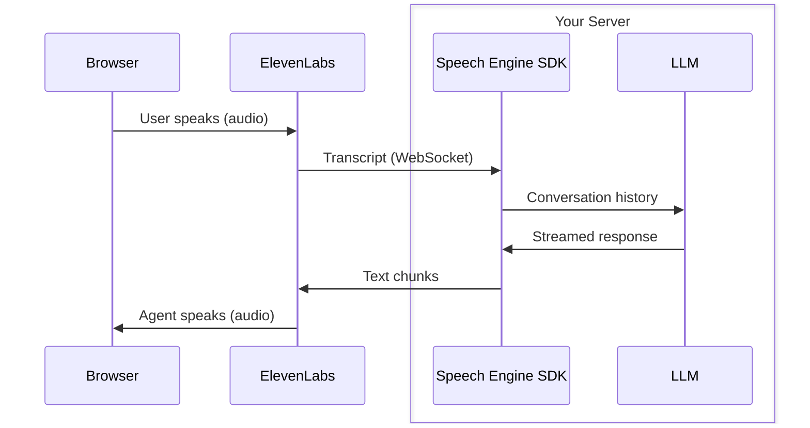

> This is a page from the ElevenLabs documentation. For a complete page index, fetch https://elevenlabs.io/docs/llms.txt. For the full documentation in a single file, fetch https://elevenlabs.io/docs/llms-full.txt.

# Speech Engine quickstart

This guide walks you through building a voice-powered agent with Speech Engine. You set up a server that connects your LLM to ElevenLabs, then wire up a browser client so users can have voice conversations with your agent.

Use the [ElevenLabs Speech Engine skill](https://github.com/elevenlabs/skills/tree/main/speech-engine) to add voice to your chat agent:

```bash
npx skills add elevenlabs/skills --skill speech-engine
```

## How Speech Engine works

Speech Engine connects your LLM to ElevenLabs so that users can speak to your agent and hear it respond. ElevenLabs handles speech-to-text and text-to-speech; your server provides the LLM logic.



Each WebSocket connection represents one conversation. When the user speaks, ElevenLabs transcribes the audio and sends the transcript to your server. Your server passes it to your LLM, then streams the response back. ElevenLabs converts the text to speech and plays it in the browser. The SDK handles connection management, turn-taking, and interruption detection.

## Prerequisites

This tutorial uses OpenAI's API for the LLM. You need an OpenAI API key set in the `OPENAI_API_KEY` environment variable.

## Server setup

[Create an API key in the dashboard here](https://elevenlabs.io/app/settings/api-keys), which you’ll use to securely [access the API](/docs/api-reference/authentication).

Store the key as a managed secret and pass it to the SDKs either as a environment variable via an `.env` file, or directly in your app’s configuration depending on your preference.

```js title=".env"
ELEVENLABS_API_KEY=<your_api_key_here>
```

```python
pip install elevenlabs openai python-dotenv
```

```typescript
npm install @elevenlabs/elevenlabs-js openai
```

Speech Engine needs a publicly reachable URL. Use [ngrok](https://ngrok.com) to expose your local server. The server is not built yet, but ngrok needs to be running first so you have the URL for the next step.

```bash
ngrok http 3001
```

Copy the forwarding URL (e.g. `https://abc123.ngrok.io`).

Use the SDK to create a Speech Engine instance, passing your ngrok URL with the `/ws` path appended as the WebSocket URL.

```python title="create_engine.py"
import asyncio
from dotenv import load_dotenv
from elevenlabs import AsyncElevenLabs

load_dotenv()

elevenlabs = AsyncElevenLabs(
    api_key=os.getenv("ELEVENLABS_API_KEY"),
)


async def main():
    engine = await elevenlabs.speech_engine.create(
        name="My Speech Engine",
        speech_engine={
            # Note we use the wss protocol instead of https
            "ws_url": "wss://abc123.ngrok.io/ws",
        },
    )

    print(f"Speech Engine ID: {engine.engine_id}")


if __name__ == "__main__":
    asyncio.run(main())
```

```typescript title="create-engine.mts"
import { ElevenLabsClient } from "@elevenlabs/elevenlabs-js";
import "dotenv/config";

const elevenlabs = new ElevenLabsClient({
  apiKey: process.env.ELEVENLABS_API_KEY,
});

const engine = await elevenlabs.speechEngine.create({
  name: "My Speech Engine",
  speechEngine: {
    // Note we use the wss protocol instead of https
    wsUrl: "wss://abc123.ngrok.io/ws",
  },
});

console.log("Speech Engine ID:", engine.engineId);
```

Run this script and copy the Speech Engine ID (e.g. `seng_8k3m9xr4hjnfg983brhmhkd98n6`) for the next step.

Create a file called `server.py` or `server.mts` with the following contents. This sets up a server, attaches Speech Engine on the `/ws` path, and uses OpenAI to generate responses.

```python maxLines=0 title="server.py"
import asyncio
import os

from dotenv import load_dotenv
from openai import AsyncOpenAI
from elevenlabs import AsyncElevenLabs

load_dotenv()

# Replace with your Speech Engine ID from step 4
SPEECH_ENGINE_ID = "seng_8k3m9xr4hjnfg983brhmhkd98n6"

openai = AsyncOpenAI(
  api_key=os.getenv("OPENAI_API_KEY"),
)
elevenlabs = AsyncElevenLabs(
  api_key=os.getenv("ELEVENLABS_API_KEY"),
)


def on_init(conversation_id, session):
    print(f"Session started: {conversation_id}")


async def on_transcript(transcript, session):
    stream = await openai.responses.create(
        model="gpt-4o",
        instructions="You are a helpful voice assistant. Keep responses concise and conversational.",
        input=[
            {"role": "assistant" if m.role == "agent" else m.role, "content": m.content}
            for m in transcript
        ],
        stream=True,
    )

    await session.send_response(stream)


def on_close(session):
    print(f"Session ended: {session.conversation_id}")


def on_error(err, session):
    print(f"Error: {err}")


async def main():
    engine = await elevenlabs.speech_engine.get(SPEECH_ENGINE_ID)

    await engine.serve(
        port=3001,
        path="/ws",
        debug=True,
        on_init=on_init,
        on_transcript=on_transcript,
        on_close=on_close,
        on_error=on_error,
    )


if __name__ == "__main__":
    asyncio.run(main())
```

```typescript maxLines=0 title="server.mts"
import { ElevenLabsClient } from "@elevenlabs/elevenlabs-js";
import { createServer } from "node:http";
import OpenAI from "openai";
import "dotenv/config";

// Replace with your Speech Engine ID from step 4
const SPEECH_ENGINE_ID = "seng_8k3m9xr4hjnfg983brhmhkd98n6";

const elevenlabs = new ElevenLabsClient({
  apiKey: process.env.ELEVENLABS_API_KEY,
});
const openai = new OpenAI({
  apiKey: process.env.OPENAI_API_KEY,
});

const httpServer = createServer();

await elevenlabs.speechEngine.attach(SPEECH_ENGINE_ID, httpServer, "/ws", {
  debug: true,

  onInit(conversationId) {
    console.log("Session started:", conversationId);
  },

  async onTranscript(transcript, signal, session) {
    const response = await openai.responses.create(
      {
        model: "gpt-4o",
        instructions:
          "You are a helpful voice assistant. Keep responses concise and conversational.",
        input: transcript.map((m) => ({
          role: m.role === "agent" ? "assistant" : m.role,
          content: m.content,
        })),
        stream: true,
      },
      { signal },
    );

    session.sendResponse(response);
  },

  onClose(session) {
    console.log("Session ended:", session.conversationId);
  },

  onError(err) {
    console.error("Error:", err);
  },
});

httpServer.listen(3001, () => {
  console.log("Speech Engine server listening on port 3001");
});
```

The `onTranscript` / `on_transcript` callback receives the full conversation history and the current session. The TypeScript SDK also provides an `AbortSignal` that fires if the user interrupts mid-response. Passing `signal` to the OpenAI call cancels the LLM request automatically on interruption.

`sendResponse()` / `send_response()` accepts a string, an async iterable, or a stream from OpenAI, Anthropic, or Google Gemini. The SDK extracts the text content automatically.

In the above example, the full transcript from the user is passed to the LLM. In a production environment you should add guardrails to prevent any prompt injection or manipulation attempts.

```python
python server.py
```

```typescript
npx tsx server.mts
```

## Client setup

```bash
npm install @elevenlabs/react
```

```bash
npm install @elevenlabs/client
```

Add a server-side endpoint that generates a conversation token. This keeps your API key out of the browser and uses WebRTC for the best audio quality.

```python title="token_server.py"
import os

from dotenv import load_dotenv
from flask import Flask, jsonify
from elevenlabs import ElevenLabs

load_dotenv()

app = Flask(__name__)
elevenlabs = ElevenLabs(
    api_key=os.getenv("ELEVENLABS_API_KEY"),
)


@app.route("/api/token")
def get_token():
    # Replace with your Speech Engine ID from step 4 of the server setup
    speech_engine_id = "seng_8k3m9xr4hjnfg983brhmhkd98n6"

    response = elevenlabs.conversational_ai.conversations.get_webrtc_token(
        agent_id=speech_engine_id,
    )

    return jsonify(token=response.token)


if __name__ == "__main__":
    app.run(port=3002)
```

```typescript title="token-server.mts"
import express from "express";
import { ElevenLabsClient } from "@elevenlabs/elevenlabs-js";
import "dotenv/config";

const app = express();
const elevenlabs = new ElevenLabsClient({
  apiKey: process.env.ELEVENLABS_API_KEY,
});

app.get("/api/token", async (req, res) => {
  // Replace with your Speech Engine ID from step 4 of the server setup
  const speechEngineId = "seng_8k3m9xr4hjnfg983brhmhkd98n6";

  const response = await elevenlabs.conversationalAi.conversations.getWebrtcToken({
    agentId: speechEngineId,
  });

  res.json({ token: response.token });
});

app.listen(3002, () => {
  console.log("Token server listening on port 3002");
});
```

Fetch the conversation token from your server and use it to start a session.

```tsx title="App.tsx"
import { useConversation } from "@elevenlabs/react";
import { useCallback } from "react";

async function getToken(): Promise<string> {
  const response = await fetch("/api/token");
  if (!response.ok) {
    throw Error("Failed to get conversation token");
  }
  const data = await response.json();
  return data.token;
}

export default function App() {
  const conversation = useConversation({
    onConnect: () => console.log("Connected"),
    onDisconnect: () => console.log("Disconnected"),
    onError: (error: Error) => console.error("Error:", error),
  });

  const startConversation = useCallback(async () => {
    await navigator.mediaDevices.getUserMedia({ audio: true });
    const token = await getToken();
    await conversation.startSession({ conversationToken: token });
  }, [conversation]);

  const stopConversation = useCallback(async () => {
    await conversation.endSession();
  }, [conversation]);

  return (
    <div>
      <p>Status: {conversation.status}</p>
      <button onClick={startConversation} disabled={conversation.status === "connected"}>
        Start conversation
      </button>
      <button onClick={stopConversation} disabled={conversation.status !== "connected"}>
        End conversation
      </button>
    </div>
  );
}
```

```typescript title="main.ts"
import { Conversation } from "@elevenlabs/client";

let conversation: Conversation | null = null;

async function getToken(): Promise<string> {
  const response = await fetch("/api/token");
  if (!response.ok) throw Error("Failed to get conversation token");
  const data = await response.json();
  return data.token;
}

document.getElementById("start")!.addEventListener("click", async () => {
  await navigator.mediaDevices.getUserMedia({ audio: true });
  const token = await getToken();

  conversation = await Conversation.startSession({
    conversationToken: token,
    onConnect: () => {
      document.getElementById("status")!.textContent = "Connected";
      (document.getElementById("start") as HTMLButtonElement).disabled = true;
      (document.getElementById("stop") as HTMLButtonElement).disabled = false;
    },
    onDisconnect: () => {
      document.getElementById("status")!.textContent = "Disconnected";
      (document.getElementById("start") as HTMLButtonElement).disabled = false;
      (document.getElementById("stop") as HTMLButtonElement).disabled = true;
    },
    onError: (error) => console.error("Error:", error),
  });
});

document.getElementById("stop")!.addEventListener("click", () => {
  if (conversation) conversation.endSession();
});
```

Make sure three processes are running:

1. **ngrok** - forwarding to port 3001
2. **Your Speech Engine server** - `python server.py` or `npx tsx server.mts`
3. **The token server** - `npx tsx token-server.mts` or `python token_server.py`

Open your client application in the browser and click **Start conversation**. Grant microphone access when prompted, then speak. You should hear the agent respond through your speakers.

If you have `debug: true` enabled on the server, you will see incoming transcripts and outgoing responses logged to the console.

## Session events

| Event             | TypeScript callback | Python callback | Description                                                                      |
| ----------------- | ------------------- | --------------- | -------------------------------------------------------------------------------- |
| `user_transcript` | `onTranscript`      | `on_transcript` | User speech transcribed. Includes full conversation history and an abort signal. |
| `init`            | `onInit`            | `on_init`       | Session initialized with a conversation ID.                                      |
| `close`           | `onClose`           | `on_close`      | Clean disconnect from ElevenLabs.                                                |
| `disconnected`    | `onDisconnect`      | `on_disconnect` | WebSocket dropped unexpectedly.                                                  |
| `error`           | `onError`           | `on_error`      | Protocol or WebSocket error.                                                     |

## Configuring the first agent message

By default, the agent waits for the user to speak first. To have the agent greet the user when the conversation starts, set a first message in the `overrides` option on the client when starting the session.

To allow the agent to speak first, we need to update the Speech Engine resource to allow setting this from the client.

```python
engine = await elevenlabs.speech_engine.update(
    speech_engine_id="seng_8k3m9xr4hjnfg983brhmhkd98n6",
    overrides={
      "first_message": True,
    },
)
```

```typescript
const engine = await elevenlabs.speechEngine.update("seng_8k3m9xr4hjnfg983brhmhkd98n6", {
  overrides: {
    firstMessage: true,
  },
});
```

Then we configure the first message in the client SDK.

```tsx
conversation.startSession({
  conversationToken: token,
  overrides: {
    agent: {
      firstMessage: "Hello! How can I help you today?",
    },
  },
});
```

```typescript
const conversation = await Conversation.startSession({
  conversationToken: token,
  overrides: {
    agent: {
      firstMessage: "Hello! How can I help you today?",
    },
  },
});
```

The first message is spoken by the agent as soon as the connection is established. It does not trigger the `onTranscript` callback on your server - it is handled entirely on the ElevenLabs side.

## Next steps

Classes, methods, and events for the JavaScript SDK.

Classes, methods, and events for the Python SDK.

Explore all Speech Engine parameters and response formats.

Run a complete Speech Engine quickstart app locally.