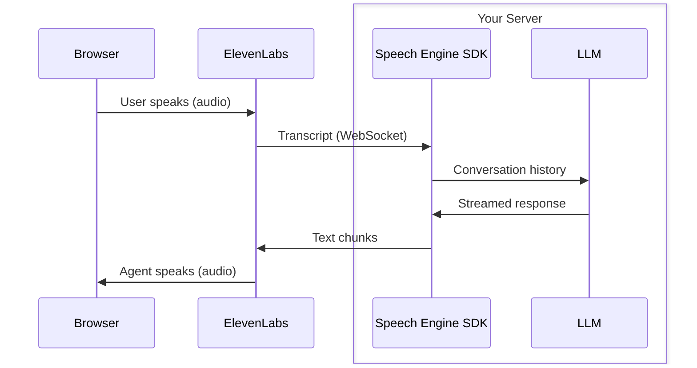

> This is a page from the ElevenLabs documentation. For a complete page index, fetch https://elevenlabs.io/docs/llms.txt. For the full documentation in a single file, fetch https://elevenlabs.io/docs/llms-full.txt.

# Speech Engine

## Overview

ElevenLabs Speech Engine adds voice capabilities to any chat agent. ElevenLabs handles speech-to-text and text-to-speech while your server provides the LLM logic. The SDK manages connection lifecycle, turn-taking, and interruption detection so you can focus on your agent's behavior.

Build a voice agent with the ElevenLabs SDK.

Classes, methods, and events for the JavaScript SDK.

Classes, methods, and events for the Python SDK.

## How it works

Speech Engine connects your server to ElevenLabs over WebSocket. Each connection represents one conversation.

1. A user speaks in the browser. ElevenLabs captures the audio and transcribes it.
2. The transcript is sent to your server along with the full conversation history.
3. Your server passes the transcript to your LLM and streams the response back.
4. ElevenLabs converts the text to speech and plays it in the browser.

## When to use Speech Engine

Speech Engine is designed for developers who want to bring their own LLM and control the conversation logic on their own server. Use it when you need to:

* Add voice to an existing text-based chat agent
* Use a specific LLM, fine-tuned model, or custom inference pipeline
* Keep full control over conversation routing, context management, and tool calling
* Integrate voice into an existing server application (Express, FastAPI, etc.)

If you want a fully hosted solution where ElevenLabs provides the LLM, knowledge base, and tools, use [ElevenAgents](/docs/eleven-agents/overview) instead.

## Key features

* **Any LLM** - use OpenAI, Anthropic, Google Gemini, or any model that produces text. The SDK auto-extracts text from OpenAI, Anthropic, and Gemini stream formats.
* **Interruption handling** - when the user speaks mid-response, the SDK cancels the in-flight LLM request automatically via an `AbortSignal` (TypeScript) or task cancellation (Python).
* **Streaming** - responses are streamed to the browser as they are generated. Pass a string, an async iterable, or a native LLM stream object.
* **Turn-taking** - the SDK manages conversation turns, so your server only needs to respond to transcripts.

## IP whitelisting

If your server is behind a firewall or uses IP-based access controls, you can whitelist the static egress IPs from which ElevenLabs WebSocket connections originate.

For additional security, you can whitelist the following static egress IPs from which ElevenLabs requests originate:

| Region       | IP Address     |
| ------------ | -------------- |
| US (Default) | 34.67.146.145  |
| US (Default) | 34.59.11.47    |
| EU           | 35.204.38.71   |
| EU           | 34.147.113.54  |
| Asia         | 35.185.187.110 |
| Asia         | 35.247.157.189 |

If you are using a [data residency region](/docs/overview/administration/data-residency) then the following IPs will be used:

| Region              | IP Address     |
| ------------------- | -------------- |
| EU Residency        | 34.77.234.246  |
| EU Residency        | 34.140.184.144 |
| India Residency     | 34.93.26.174   |
| India Residency     | 34.93.252.69   |
| Singapore Residency | 34.87.23.17    |
| Singapore Residency | 34.126.179.103 |

If your infrastructure requires strict IP-based access controls, adding these IPs to your firewall allowlist will ensure you only receive requests from ElevenLabs' systems.

These static IPs are used across all ElevenLabs services including webhooks and MCP server
requests, and will remain consistent.

Using IP whitelisting ensures your server only accepts WebSocket connections from ElevenLabs'
systems.

## FAQ

Any LLM that produces text. The SDK has built-in stream extraction for OpenAI (Responses API and
Chat Completions API), Anthropic Messages API, and Google Gemini API. For other providers, pass
a plain string or an async iterable of string chunks.

ElevenAgents is a fully hosted platform where ElevenLabs provides the LLM, knowledge base, and
tools. Speech Engine is for developers who want to bring their own LLM and control the
conversation logic on their own server.

In TypeScript, you can attach Speech Engine to any Node.js HTTP server (Express, Fastify, or
plain `http.createServer()`), or run a standalone WebSocket server. In Python, the SDK provides
a standalone server via `engine.serve()`, or you can integrate with FastAPI, Starlette, or any
ASGI framework using `engine.create_session()`.