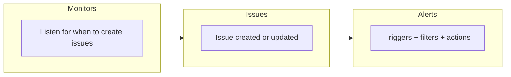

# Monitors and Alerts

Sentry separates **what you detect** from **what you do about it**:

* [**Monitors**](https://docs.sentry.io/product/monitors-and-alerts/monitors.md) watch your application's health and behavior. There are default detectors that pull data from your SDK integration. Custom configurations like cron schedules, HTTP uptime, and metric thresholds on errors, spans, logs, releases, and application metrics can also be monitored. With Monitors, these signals are turned into **issues** when conditions are met.
* [**Alerts**](https://docs.sentry.io/product/monitors-and-alerts/alerts.md) run when **issues** match the triggers and filters you configure, and carry out **actions** like sending notifications via Slack, email, PagerDuty, or webhooks, or creating work items in Jira and similar tools.

Using both Monitors and Alerts gives you a path from signal → triageable issue → team workflow, without wiring every integration by hand for every edge case.

For a concise **Issues-centric** explanation (how this shows up in your triage flow), see [Monitors and Alerts](https://docs.sentry.io/product/issues/monitors-and-alerts.md). For **hands-on setup**, see [Creating an Alert](https://docs.sentry.io/product/monitors-and-alerts/alerts.md#creating-an-alert).

## [End-to-End Flow](https://docs.sentry.io/product/monitors-and-alerts.md#end-to-end-flow)

1. **Monitor** evaluates data on a schedule or on incoming events and decides whether to open or update an **issue**.
2. **Alert** rules listen for issue lifecycle and attribute changes (and can be limited to certain Monitors or projects).
3. When a rule matches, **actions** run: notify people, open tickets, call integrations.

## [Where to Go Next](https://docs.sentry.io/product/monitors-and-alerts.md#where-to-go-next)

| Goal                                                  | Documentation                                                                                               |
| ----------------------------------------------------- | ----------------------------------------------------------------------------------------------------------- |
| Configure detectors (cron, uptime, metrics, defaults) | [Monitors](https://docs.sentry.io/product/monitors-and-alerts/monitors.md)                                  |
| Configure notifications, tickets, and webhooks        | [Alerts](https://docs.sentry.io/product/monitors-and-alerts/alerts.md)                                      |
| Sentry notifications (email, quota, and so on)        | [Notifications](https://docs.sentry.io/product/notifications.md)                                            |
| Reduce noise and choose thresholds                    | [Alerts Best Practices](https://docs.sentry.io/product/monitors-and-alerts/alerts.md#alerts-best-practices) |

## [Learn More](https://docs.sentry.io/product/monitors-and-alerts.md#learn-more)

* #### [Alerts](https://docs.sentry.io/product/monitors-and-alerts/alerts.md)

  Use Alerts to notify or take action on important issues.

* #### [Monitors](https://docs.sentry.io/product/monitors-and-alerts/monitors.md)

  Generate issues and trigger alerts by creating custom monitors to track errors, performance, and metrics.

## Pages in this section

- [Alerts](https://docs.sentry.io/product/monitors-and-alerts/alerts.md)
- [Monitors](https://docs.sentry.io/product/monitors-and-alerts/monitors.md)
