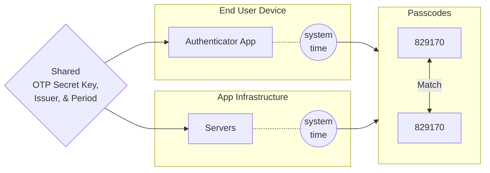

# What is a Time-based One-time Password (TOTP)?

A standardized algorithm that uses the device time as an input and generates unique numeric passwords. A *Time-based One-Time Password* (TOTP) serves as a form of two-factor authentication (2FA). Other terms for TOTP include app-based authentication, software tokens, or soft tokens. [RFC 6238][rfc6238] defines this algorithm. When used as a second factor, the TOTP increases account security.

Authentication apps support the TOTP standard.

In addition to [SMS, voice][], [email][], and [push][] channels, the Twilio [Verify API][verify-api] supports TOTP authentication.

## One-time passwords for two factor authentication

By requiring two types, or *factors*, of authentication, [2FA][] adds an extra layer of account protection. This can be knowledge (something a user *knows*, like a password) and possession (something the user *has*, like a phone). One-time passwords like TOTP are a common possession factor.

A [2019 study][speed-study] about the usability of 2FA methods found that TOTP had the highest usability score of the various second factors tested. This study explains that TOTP is both viable and user preferred.

## Time-based vs. counter-based one-time password algorithms

One-time password options can also use a *Hash-based Message Authentication Code* ([HMAC][]). [RFC 4226][rfc4226] defines the HOTP standard.

TOTP bases its approach on the *HMAC-based One-Time Password* (HOTP) algorithm. While both methods use a secret key as one of the inputs, TOTP uses the system *time* for the other input, and HOTP uses a *counter*. This counter increments with each validation. With HOTP, both parties increment the counter and use that to compute the one-time password.

Most consumer authenticator apps implement the TOTP standard.

## Algorithm

Defined in [RFC 6238][rfc6238], the TOTP algorithm takes a shared secret key and the device time as inputs. For the shared secret key, the algorithm uses a form of symmetric key cryptography. Both parties use the same key to generate and validate the token.

The TOTP algorithm takes the device time and a stored secret key as inputs. Generating or verifying a token doesn't require internet connectivity, so a user can use TOTP through an app while offline. The following diagram shows how both parties calculate the passcode.

## Comparison of TOTP to SMS as 2FA solution

While SMS has built [2FA adoption][], TOTP has several benefits including:

* Offline support
* Registration without providing personally identifiable information (PII)
* [Standardized][] authentication solution
* Software-based
* Independent of carrier fees or telephony access and deliverability
* [Faster][speed-study] average time to authenticate
* Increased security
  * The TOTP-required secret key gets shared once.
  * TOTP doesn't need a carrier network, which reduces the attack surface.
  * TOTP has stronger proof of possession than SMS as one can access it only from one place.

To give users a choice of options, most Twilio customers implement multiple forms of 2FA. Twilio Verify also supports other channels, including [push][], voice, and [email][].

## Related resources

To learn more about the Twilio APIs for multichannel user verification, see these resources.

* [Verify TOTP Quickstart][totp-qs]
* [Verify API reference][verify-api]
* [Verify customers][]
* [Verify pricing][]
* [TOTP sample application][totp-app]

[2FA adoption]: https://www.twilio.com/blog/sms-2fa-security

[2FA]: /docs/glossary/what-is-two-factor-authentication-2fa

[email]: /docs/verify/email

[HMAC]: https://en.wikipedia.org/wiki/HMAC-based_One-Time_Password

[push]: /docs/verify/push

[speed-study]: https://www.usenix.org/system/files/soups2019-reese.pdf

[rfc4226]: https://datatracker.ietf.org/doc/html/rfc4226

[rfc6238]: https://datatracker.ietf.org/doc/html/rfc6238

[SMS, voice]: https://www.twilio.com/code-exchange/one-time-passcode-verification-otp

[Standardized]: https://datatracker.ietf.org/doc/html/rfc6238

[totp-qs]: /docs/verify/quickstarts/totp

[totp-app]: https://www.twilio.com/code-exchange/verify-totp

[verify-api]: /docs/verify/api

[Verify customers]: https://customers.twilio.com/2303/stripe/

[Verify pricing]: https://www.twilio.com/en-us/verify/pricing
