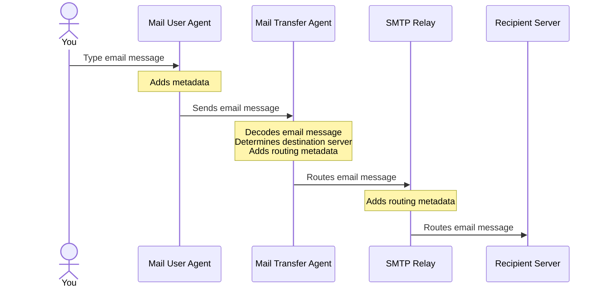

# Simple Mail Transfer Protocol (SMTP)

*Internet standard*. The communication rules that systems follow for the reliable and efficient transfer of email messages. [RFC 821][rfc821] defines this standard.

## SMTP workflow

1. You compose and email and press **Send**.
2. Your [Mail User Agent (MUA)][mua], the email app, adds some metadata called [headers][header] to your email message. These include `To`, `From`, and `Subject`.
3. The message passes to a [Mail Transfer Agent (MTA)][mta], usually an [SMTP server][smtp-server].
4. The MTA performs a few operations:
   1. Decodes your email.
   2. Determines which server the message must be sent to for your recipient to retrieve it.
   3. Adds routing metadata like `Received`, `Date`, and other data.
   4. Issues SMTP commands that start the routing the email message to the receiving server.
5. If the email message crosses domains, the messages use an [SMTP relay][smtp-relay].
6. When the recipient's email provider, like Yahoo! or Gmail, receives the message, it downloads and delivers it to the appropriate inbox.

[header]: /docs/sendgrid/glossary/header

[smtp-relay]: /docs/sendgrid/glossary/smtp-relay

[smtp-server]: /docs/sendgrid/glossary/smtp-server

[rfc821]: https://datatracker.ietf.org/doc/html/rfc821

[mta]: /docs/sendgrid/glossary/mta

[mua]: /docs/sendgrid/glossary/mua
