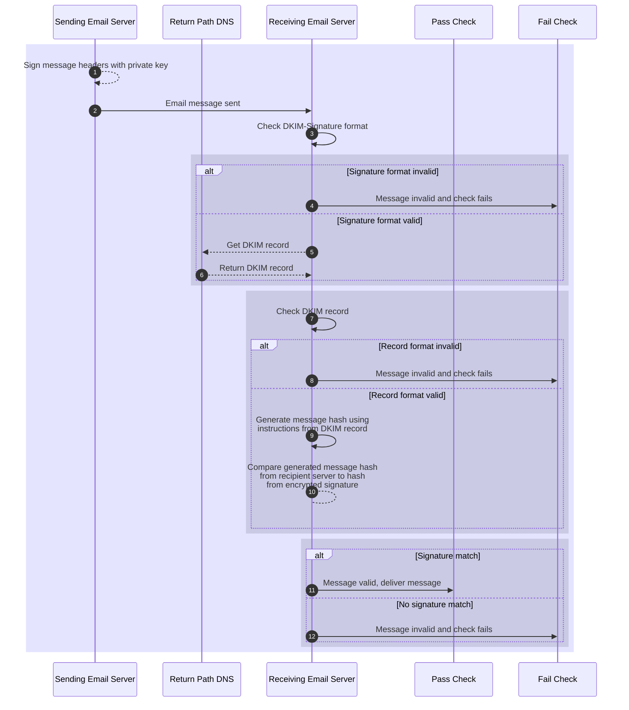

# Verify message integrity with DKIM

[DomainKeys Identified Mail (DKIM)][dkim] provides a domain-based email authentication protocol that helps identify legitimate email messages. DKIM provides the second factor for [domain authentication][].

To activate DKIM, a domain owner adds a DKIM record as a [DNS][] [`TXT` record][TXT record] on sending domain. This `TXT` record contains instructions for verifying a message using [public-key cryptography][]. When sending email with DKIM turned on, the sending server signs the messages with a private key.

> \[!NOTE]
>
> The scope of DKIM has limits. It doesn't verify content, [the sending email server][spf], or [the message sender. Nor does it instruct the receiver how to route the message or report failed checks][dmarc-p]. It verifies *message integrity*.

## Concepts involved in DKIM

### Canonicalization

To generate the comparison values in a `DKIM-Signature`, the sending email server standardizes both headers and body content. This process is called *canonicalization*. DKIM follows the [Internet Message Format][rfc5322] format. Given this standard format, an email message can still undergo some mild modifications in transit. You can choose the level of tolerance you have for these changes as they get authenticated.

* If you want to accept common modifications, choose `relaxed`.
* If you don't want to tolerate any changes, choose `simple`.
* You can set this value for both the header and body independently, with the header listed first, then a forward slash (`/`), then the body.
* This value defaults to `simple/simple`.

This results in accepted combinations of `simple/simple`, `simple/relaxed`, `relaxed/simple`, and `relaxed/relaxed`. If you only provide one value, like `relaxed`, that value applies to the header. The body gets set to `simple` and the complete value becomes `relaxed/simple`.

The service that generates your DKIM signatures sets the method, or *algorithm*, applied to the header and body content.

* On email servers that you manage, you set the canonicalization value in the DKIM configuration file.
* Most large-scale email servers set their value to `relaxed/relaxed`.
* Twilio SendGrid sets this value to `relaxed/simple`.

To learn how canonicalization changes email message formatting, see [Canonicalization][c-value].

### Hash values

Comparing two versions of a large value has inherent difficulties. No method can compare an entire single object, like an email message, at two points in time: when one party sent it and when the intended party received it. To compare a single file from two points in time, computer systems use a digital fingerprint of the object called a *hash*. To create a hash, you use an algorithm that runs mathematical calculations on the data and returns a 256 alphanumeric string. *Hashing* describes the calculation that creates the hash.

With DKIM, the header and the body content get hashed and the recipient email server compares hashes of the original objects, not the objects themselves.

### Public-key encryption

To protect the data on disk or in transit requires encryption. The data gets transformed into a format that only certain parties can decode. Public key encryption involves a pair of keys: a public key and a private key. The private key transforms, or encodes or encrypts, the data. The party that encrypts the data keeps this key a secret. The public key decodes or decrypts the encrypted data back into its original form. The public key can be widely distributed and used to decrypt data.

With DKIM, the sending email server encrypts the hashed value with its private key. The DKIM DNS `TXT` resource record includes the public key, which can decrypt the `DKIM-Signature` and prove message data integrity.

### Base64 encoding

To convert binary data into text characters, email servers use Base64 encoding. This converts 8-bit (2^8) representations of data into 6-bit (2^6) representations of data. With this encoding, you only need 64 characters to represent any data, hence the name Base64. In practice, this means that every three bytes, or 24 bits, of data gets converted into four characters. This encoding allows sending of any type of data including images and attachments.

To ensure transmission of all types of data and not just text, DKIM encodes the data with Base64.

## Implement DKIM

DKIM implementation requires creating the instructions and public key stored on the sender's domain and configuring any DKIM settings on the email server.

### Process flow for DKIM on sending domain systems

With DKIM, receiving email servers check the integrity of incoming email messages in the following process:

1. Identify or install a DKIM processor on your sending email server.
2. Configure the basic settings for the DKIM processor, like the canonical algorithm.
3. Generate a DKIM key pair on your sending email server. If prompted, use the following parameters:
   * **selector**: A unique identifier for the key, like a subdomain or a hostname for a server.
   * **key size**: The cryptographic strength or size of the key in bits, either `1024` or `2048`.
4. Copy the public key.
5. Create a [`TXT`][TXT] [DNS][dns] record.
   * Set the record label to `<selector>._domainkey.<domain>`.
   * Set the record value to the signature, outlined in the DKIM record format.
6. When sending an email message, your sending message transfer agent ([MTA][]) creates your `DKIM-Signature` and adds it to the message.

To implement DKIM for your account on Twilio SendGrid, see the [Domain Authentication][] guide.

### Format of a DKIM record in DNS

An DKIM record resides as the value of a DNS `TXT` labeled `<selector>._domainkey.<domain>` with a value that resembles the following:

```text {title="Example of a DKIM DNS TXT record"}
k=rsa;t=s;p=MIGfMA0GCSqGSIb3DQEBAQUAA4GNADCBiQKBgQDDmzRmJRQxLEuyYiyMg4suA2SyMwR5MGHpP9dNT1hRiwUd/mZp1ro7kIDTKS8ttkI6z6eTRW9e9dDOxzSxNuXmume60Cjbu08gOyhPG3GfWdg7QkdN6kR4V75MFlw624VY35DaXBvnlTJTgRg/EW72O1DiYVThkyCgpSYS8nmEQIDAQAB
```

The `TXT` record value must adhere to the following standards:

* It must follow [RFC 1035][rfc1035] 3.3.14 format for DNS records.
* It can't exceed 512 bytes.

#### Use tags to set properties in a DKIM record

The DKIM DNS TXT record is a string limited to 512 bytes. This text consists of a series of semi-colon-separated properties called *tags*. These tags include the public key and the settings to generate a signature that matches the encrypted one in your email messages. DKIM requires only one tag: for the public key. The remaining tags provide instructions to recreate a match to your DKIM-Signature. The tags include the following string values:

***

Tag: \`v\`
Necessity: Recommended
Purpose in creating signature: The version of DKIM this record used. If present, must be the first tag.
Accepted values: \`DKIM1\`
Default value: \`DKIM1\`

***

Tag: \`h\`
Necessity: \*Optional\*
Purpose in creating signature: Comma-separated list of hashing algorithms used. To accept all algorithms, omit this property.
Accepted values: \`sha1\`,\`sha256\`
Default value: All

***

Tag: \`k\`
Necessity: \*Optional\*
Purpose in creating signature: The encryption algorithm used to encrypt the hash.
Accepted values: \`rsa\`
Default value: \`rsa\`

***

Tag: \`n\`
Necessity: \*Optional\*
Purpose in creating signature: Notes of interest that might interest another human.
Accepted values:&#x20;
Default value:&#x20;

***

Tag: \`p\`
Necessity: Required
Purpose in creating signature: Base64-encoded public encryption key that encrypted the signature.
If you revoked your public key, leave this as an empty value.
Accepted values:&#x20;
Default value:&#x20;

***

Tag: \`s\`
Necessity: \*Optional\*
Purpose in creating signature: The internet service for which this signature was created.
Accepted values:&#x20;
Default value: \`\*\`

***

Tag: \`t\`
Necessity: \*Optional\*
Purpose in creating signature: Colon-separated list of flags that toggle features of this signature.
To test DKIM without rejecting failed signature verifications, add \`y\`.
To deny use of subdomains, add \`s\`. You can add both.
Accepted values: \`y\`,\`s\`
Default value: \`none\`

***

### Add DKIM records for your Twilio SendGrid email

To improve your email deliverability, Twilio turns on DKIM for all email messages. This provides you with a custom DKIM record. When you configuring an [authenticated domain][Domain Authentication], choose *automated* or *manual* security.

These differ in who updates to DNS records and the DKIM signature after making changes that impact deliverability. This could include adding another dedicated sending IP address or granting a subdomain permission to send email messages.

* Automated security grants Twilio permission to make updates on your behalf.
* Manual security leaves updates to your best efforts.

## Automated security

When you turn on automated security, Twilio generates three canonical name (`CNAME`) resource records. With these records set, Twilio SendGrid manages your DKIM and [SPF][] records. Whenever you change an account setting that could impact your deliverability, like adding a dedicated IP address, Twilio SendGrid updates your DNS settings and your DKIM signature.

Twilio uses multiple selectors (`s1` and `s2`, by default) interchangeably and rotates them when necessary. Twilio only activates one selector for generating DKIM signatures at any given time.

> \[!NOTE]
>
> | DNS record                   | Type    | Record value                            |
> | ---------------------------- | ------- | --------------------------------------- |
> | `subdomain.example.com.`     | `CNAME` | `uXXXXXXX.wlXXX.sendgrid.net`           |
> | `s1._domainkey.example.com.` | `CNAME` | `s1.domainkey.uXXX.wlXXX.sendgrid.net.` |
> | `s2._domainkey.example.com.` | `CNAME` | `s2.domainkey.uXXX.wlXXX.sendgrid.net.` |

## Manual security

When you turn off automated security, Twilio generates three resource records: two text (`TXT`) and one [mail exchange (`MX`)][mx]. Whenever you make a change to your sending domain, you must update your DKIM record on your domain.

> \[!NOTE]
>
> | DNS record           | Type  | Record value                       |
> | -------------------- | ----- | ---------------------------------- |
> | `em1234.example.com` | `MX`  | `mx.sendgrid.net`                  |
> | `em1234.example.com` | `TXT` | `v=spf1 include:sendgrid.net ~all` |
> | `m1._example.com`    | `TXT` | `k=rsa; t=s; p=MIGfMA0GCS...`      |

## Authenticate email messages with DKIM

To verify the authenticity of a message's signature, receiving mail servers parse the DKIM-Signature email header.

### DKIM-Signature header in an email message

With DKIM turned on, the sending email server adds an `DKIM-Signature` metadata [header][] to each email message. This header resembles the following example:

```text {title="Example of a DKIM-Signature email message header"}
DKIM-Signature: v=1; a=rsa-sha256; d=example.net; s=brisbane;
     c=relaxed/simple; q=dns/txt; i=foo@eng.example.net;
     t=1117574938; x=1118006938; l=200;
     h=from:to:subject:date:keywords:keywords;
     z=From:foo@eng.example.net|To:joe@example.com|
       Subject:demo=20run|Date:July=205,=202005=203:44:08=20PM=20-0700;
     bh=MTIzNDU2Nzg5MDEyMzQ1Njc4OTAxMjM0NTY3ODkwMTI=;
     b=dzdVyOfAKCdLXdJOc9G2q8LoXSlEniSbav+yuU4zGeeruD00lszZVoG4ZHRNiYzR
```

### Use tags to set properties in the DKIM-Signature

The properties in a DKIM-Signature email header also use tags. DKIM requires email messages to include seven of these tags.

***

Tag: \`v\`
Necessity: Required
Data type: Integer
Purpose: DKIM version
Accepted values: \`1\`
Default value:&#x20;

***

Tag: \`a\`
Necessity: Required
Data type: String
Purpose: compound set of cryptographic algorithms used to generate the signature; encryption algorithm, a dash, and the hash algorithm
Accepted values: \`rsa-sha256\`,
\`ed25519-sha256\`
Default value: \`rsa-sha256\`

***

Tag: \`d\`
Necessity: Required
Data type: String
Purpose: domain name of the signing entity also known as the Signing Domain Identifier (SDID)
Accepted values:&#x20;
Default value:&#x20;

***

Tag: \`s\`
Necessity: Required
Data type: String
Purpose: human-readable label that separates the namespace for the domain
Accepted values:&#x20;
Default value:&#x20;

***

Tag: \`c\`
Necessity: \*Optional\*
Data type: String
Purpose: \[algorithm(s)]\(/docs/sendgrid/glossary/canonicalization) applied to standardize the message header and body
Accepted values: \`relaxed/simple\`, \`relaxed/relaxed\`
Default value: \`simple/simple\`

***

Tag: \`q\`
Necessity: \*Optional\*
Data type: String
Purpose: colon-separated list of query methods used to retrieve the public key
Accepted values: \`dns/txt\`
Default value: \`dns/txt\`

***

Tag: \`i\`
Necessity: \*Optional\*
Data type: String
Purpose: email address of the user or agent on whose behalf the email is signed also known as the Agent or User Identifier (AUID)
Accepted values:&#x20;
Default value:&#x20;

***

Tag: \`t\`
Necessity: Recommended
Data type: Integer
Purpose: UNIX timestamp when the signature was created
Accepted values:&#x20;
Default value:&#x20;

***

Tag: \`x\`
Necessity: Recommended
Data type: Integer
Purpose: UNIX timestamp when the signature expires
Accepted values:&#x20;
Default value:&#x20;

***

Tag: \`l\`
Necessity: \*Optional\*
Data type: Integer
Purpose: number of bytes in the message body to include in the hash
Accepted values:&#x20;
Default value:&#x20;

***

Tag: \`h\`
Necessity: Required
Data type: String
Purpose: colon-separated ordered list of signed email header fields
Accepted values:&#x20;
Default value:&#x20;

***

Tag: \`z\`
Necessity: \*Optional\*
Data type: String
Purpose: vertical-bar-separated list of selected header field names and their values present when the message was signed
Accepted values:&#x20;
Default value:&#x20;

***

Tag: \`bh\`
Necessity: Required
Data type: String
Purpose: Base64-encoded hash of the message body
Accepted values:&#x20;
Default value:&#x20;

***

Tag: \`b\`
Necessity: Required
Data type: String
Purpose: Base64-encoded signature of the message headers and body
Accepted values:&#x20;
Default value:&#x20;

***

### Process flow for DKIM on receiving email server

With DKIM, receiving email servers check the integrity of incoming email messages in the following process:

1. The receiving server checks the format of the `DKIM-Signature` header. If the `DKIM-Signature` meets any of the following conditions, the check *fails*.
   * Signature misses one of the required tags: `v=`, `a=`, `b=`, `bh=`, `d=`, `h=`, and `s=`.
   * The domain in the `i=` tag doesn't match the complete or parent domain in the `d=` tag.
   * The `h=` tag doesn't include the `From` header.
2. The receiving server sends a request to the sending domain's DNS server, based on the `s=` and `d=` tags of the signature, following the method in the `q=` tag. The `q=` tag only accepts a value of `dns/txt`, which translates to check the `TXT` record in the `DNS` server.
   * If the query fails to respond, the recipient can try again later.
   * If the query responds that the DKIM record doesn't exist, the check fails.
3. This domain's DNS server returns the DKIM record to the receiving server. If the DKIM record meets any of the following conditions, the check fails.
   * The DKIM record doesn't follow the DKIM specification.
   * The `h=` tag in the DKIM record doesn't include the value in the `a=` tag of the signature.
   * The DKIM record doesn't include a public key in the `p=` tag.
   * The `k=` tag in the DKIM record doesn't match the `a=` tag of the signature.
4. The receiving server prepares comparison values using the tags from the signature.
   1. Creates a standard version of the message body using the canonicalization algorithm from the `c=` tag.
   2. Truncates the message body length to the value of the `l=` tag.
   3. Applies the hash algorithm from the `a=` tag on the truncated, canonicalized message body. The hash algorithm defaults to [SHA256][].
   4. Converts the 256-character body hash using Base64.
   5. Compares the resulting value to the `bh=` tag value. If the values don't match, the check fails.
   6. Applies hash algorithm from the `a=` tag on the headers from the `h=` tag and their values, using the canonicalization algorithm from the `c=` tag, and the `DKIM-Signature` header itself without its `b=` tag. As the `DKIM-Signature` header includes the `bh=` tag, the body hash gets included.
   7. Applies the encryption algorithm from the `a=` tag to the combination of the headers and their values and the `DKIM-Signature` header. The encryption algorithm defaults to [RSA][], but could be [Ed25519][].
   8. Converts the 256-character encrypted header hash using Base64.
   9. Compares the resulting value to the `b=` tag. If the values don't match, the check fails.
5. The next step depends on the check result which only have one of two outcomes:
   * The check passes. The receiving email server delivers the message to the specified recipient.
   * The check fails. The receiving email server rejects the message and processes it according to the DMARC policy or the inbox provider's filtering rules.



## Additional resources

* [Sender Identity][]
* [Domain Authentication][]
* [Single Sender Verification][]
* [How to set up link branding][]
* [How to set up reverse DNS][]
* [Troubleshooting Sender Authentication][]

[c-value]: /docs/sendgrid/glossary/canonicalization

[dkim]: /docs/sendgrid/glossary/dkim

[dmarc-p]: /docs/sendgrid/ui/sending-email/dmarc

[dns]: /docs/sendgrid/glossary/dns

[Domain Authentication]: /docs/sendgrid/ui/account-and-settings/how-to-set-up-domain-authentication

[Ed25519]: https://en.wikipedia.org/wiki/EdDSA#Ed25519

[header]: /docs/sendgrid/glossary/header

[How to set up link branding]: /docs/sendgrid/ui/account-and-settings/how-to-set-up-link-branding

[How to set up reverse DNS]: /docs/sendgrid/ui/account-and-settings/how-to-set-up-reverse-dns

[MTA]: /docs/sendgrid/glossary/mta

[mx]: /docs/sendgrid/glossary/mx-record

[public-key cryptography]: https://www.twilio.com/blog/what-is-public-key-cryptography

[rfc1035]: https://datatracker.ietf.org/doc/html/rfc1035

[rfc5322]: https://datatracker.ietf.org/doc/html/rfc5322

[rsa]: https://en.wikipedia.org/wiki/RSA_cryptosystem

[Sender Identity]: /docs/sendgrid/for-developers/sending-email/sender-identity

[SHA256]: https://en.wikipedia.org/wiki/SHA-2

[Single Sender Verification]: /docs/sendgrid/ui/sending-email/sender-verification

[spf]: /docs/sendgrid/glossary/spf

[Troubleshooting Sender Authentication]: /docs/sendgrid/ui/account-and-settings/troubleshooting-sender-authentication

[TXT record]: https://en.wikipedia.org/wiki/TXT_record

[TXT]: https://en.wikipedia.org/wiki/TXT_record
