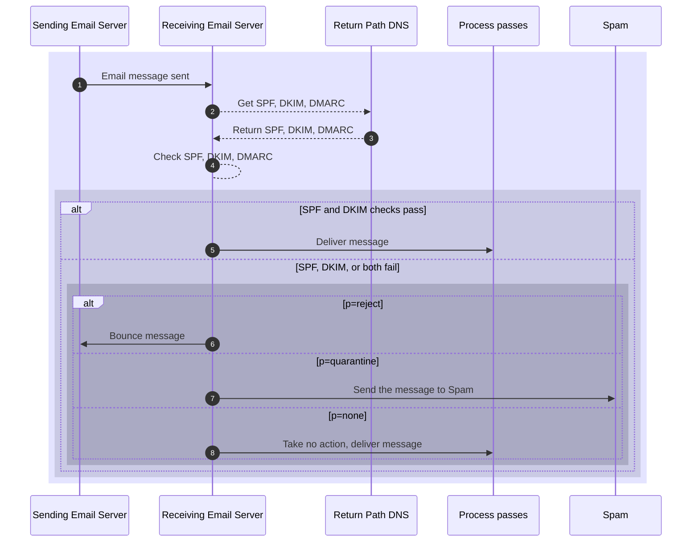

# Enforce authentication with a DMARC policy

The *Domain-based Message Authentication, Reporting, and Conformance* (DMARC) policy directs how your ISP processes email messages that pass or fail email validation checks. DMARC provides the third factor for [domain authentication][domain-auth].

To activate DMARC, a domain owner adds a DMARC record as a [DNS][] [`TXT` record][TXT] on domain that sends email messages. This `TXT` record contains instructions on how to process email messages that fail authentication checks.

> \[!NOTE]
>
> The scope of DMARC has limits. It doesn't verify content, [sender identity][], or [verify the message integrity][dkim]. It verifies the message sender, instructs the receiver how to route the message, and reports failed checks.

## Prerequisites

To add a DMARC policy to your domain, you must understand the follow concepts:

* [Domain Name System][dns] and DNS records, [TXT records][TXT record] in particular
* [IP addresses][]

## Problem that DMARC solves

To convince you that you're interacting with a trusted source, unauthorized senders might impersonate a specific email address. This act of impersonation practice is known as [*email spoofing*][spoofing]. The purpose of spoofing can include getting sensitive data, taking over other online accounts, or stealing funds.

A spoofed email includes a forged `From` address, but not the `From` the recipient sees in their inbox. Email messages have their metadata which includes two `From` addresses:

|                         | Header From                      | Envelope From                                       |
| ----------------------- | -------------------------------- | --------------------------------------------------- |
| Property name           | `From`                           | `MAIL FROM` or `Return-Path`                        |
| Location                | Email message header metadata    | STMP envelope                                       |
| Necessity               | Required                         | Required                                            |
| Visible in email client | Yes                              | No                                                  |
| Purpose                 | Shows who sent the email message | Specifies where to send non-delivery reports (NDRs) |
| Authenticated           | No                               | Yes with DKIM, SPF                                  |
| Physical analog         | Address on letterhead            | Return address on envelope                          |

Spoofing works as part of a [*phishing*][phishing] attack. Phishing seeks to get recipients to open email messages with links to malicious web sites or open damaging attachments.

While you could consider spoofing and phishing as a recipient's problem, an attacker that uses your email domain can damage your [email reputation][ers].

Two other standards, [DomainKeys Identified Mail (DKIM)][dkim] and [Sender Policy Framework (SPF)][spf], authenticate email messages and senders, respectively. DKIM only validates the email address in the Envelope From.

To prevent [email spoofing][spoofing], DMARC policies determine what recipient email servers should do with email messages that pass and fail authentication checks.

### Authenticate the email server: SPF

The SPF authenticates that the email server that sent the message can send messages on behalf of the domain. When the receiving email server gets the message, it requests the SPF record from the sender's DNS server. If the IP address or IP address range matches the IP address of the sending email server, the receiving email server accepts the incoming email message.

The SPF sets an [allowlist][] that identifies which email servers can send email messages on behalf of a given [domain][]. To implement SPF, you add a [TXT record][] to your [DNS][] server for your [domain][]. The TXT record specifies the IP addresses that can send email for the related domain.

To perform an SPF check, the following steps take place.

1. The receiving email server receives a message and checks the Envelope From (`return-path`).
2. The receiving server retrieves the SPF record from the DNS records for the domain in the `return-path`.
3. The receiving server checks the SPF record for all IP addresses approved to send email on behalf of the domain.
4. If the SPF check passes, the receiving server considers the message sent from an approved sending server and continues processing the message.
5. If the SPF check fails, the receiving server considers the message illegitimate. What happens after a failure depends on your DMARC policy.

To learn more about how SPF works, see [Verify sending email servers with SPF][spf-record].

### Authenticate email message integrity: DKIM

DKIM authenticates the integrity an email message using public-key encryption. This standard ensures that nothing tampered with the message in transit.

1. The sending email server includes a *signature* in each email message's header. The signature includes an encrypted and hashed version of the email message header and body and instructions on how to decode the signature.
2. After receiving the email message, the receiving email server requests the DKIM record from the domain's DNS provider. This includes the public key to decrypt the signature data.
3. The receiving server then recreates the signature from the email message and compares it to the decrypted and decoded signature that got sent.
4. If the signatures match, the DKIM check passes and the email message gets accepted.
5. If the signatures don't match, the DKIM check fails. What happens after a failure depends on your DMARC policy.

To learn more about how DKIM works, see [Verify senders with DKIM][dkim-record].

### Route messages that fail checks: DMARC

While DKIM authenticates the email message and SPF authenticates the sending email server, neither tells the receiving server how to act on the results of these checks. DMARC provides that function. It tells the receiving email server what to do with email messages that pass or fail authentication.

> \[!NOTE]
>
> Twilio SendGrid offers additional DMARC enforcement and monitoring options in partnership with [Valimail][].

DMARC *doesn't* work as an independent authentication protocol but as a framework for handling SPF and DKIM failures and reporting those failures to domain owners.

* DMARC allows domain owners to specify what should happen if either or both SPF and DKIM checks fail.
  * Neither SPF nor DKIM provide this functionality on their own.
  * This means that without DMARC a sender can't determine what happens to a failed message.
* A sender receives no feedback about SPF and DKIM failures without DMARC, so senders have little chance to combat or even understand the delivery trends of their domain, often called reputation monitoring.
* SPF and DKIM are independent of each other, but neither provide thorough spoofing protection on their own.

DMARC builds upon SPF and DKIM. SPF and DKIM handle the domain-based message authentication part of DMARC.

DMARC adds reporting and conformance. Like SPF and DKIM, you implement DMARC through a `TXT` DNS resource record. Using this record, receiving email servers can fetch failure processing instructions from domain owners.

To check if an organization uses DMARC, see the [DMARC.org][dmarc-faq] FAQ entry.



## DMARC policy format

To provide access to your DMARC policy, add it into the [DNS][] registry of your domain as a [`TXT` resource record][TXT]. The policy follows a format of a series of semicolon-separated *tags*:

```text {title="Example DMARC DNS TXT record"}
v=DMARC1;
p=(none|quarantine|reject);
rua=mailto:<email address>
```

The `TXT` record value must adhere to the following standards:

* It must follow [RFC 1035][rfc1035] 3.3.14 format for DNS records.
* It can't exceed 512 bytes.
* It must start with `v=DMARC1;`. This identifies the policy as using DMARC version 1.

You can write your DMARC policy yourself or use a [DMARC policy generator][dmarc-rg].

### DMARC policy tags

A DMARC policy contains several semicolon-separated (`;`) tags. DMARC requires two tags: `v` (version) and `p` (policy).

The *tag* covers the policy applied to emails that fail the DMARC check.

| Tag     | Meaning                                             | Value                                                                                                                                                                            | Accepted values                | Default value |
| ------- | --------------------------------------------------- | -------------------------------------------------------------------------------------------------------------------------------------------------------------------------------- | ------------------------------ | ------------- |
| `v`     | [DMARC protocol version][version-tag]               |                                                                                                                                                                                  | `DMARC1`                       | `DMARC1`      |
| `p`     | [Policy for DMARC check failures][policy-tag]       | The policy to apply to emails that fail the DMARC check. To collect DMARC reports, set to `none`.                                                                                | `none`, `quarantine`, `reject` |               |
| `rua`   | [Recipients of aggregate reports][report-tag]       | A list of URIs expressed as [email URIs][rfc6068] of email service providers who should receive aggregate reports expressed as email URIs.                                       | mailto URIs                    |               |
| `ruf`   | [Recipients of forensic reports][report-tag]        | A list of URIs expressed as [email URIs][rfc6068] of ISPs who should receive forensic reports                                                                                    | mailto URIs                    |               |
| `sp`    | [Policy for subdomains][subdomain-tag]              | The policy to apply to email from a subdomain of this domain that fail the DMARC check. As a domain owner, use this tag to publish a `wildcard` policy for all subdomains.       |                                |               |
| `fo`    | [Reason to generate forensic report][report-tag]    | If both DKIM and SPF fail: `0`<br />If either DKIM or SPF fail, `1`<br />If only DKIM fail, `d`<br />If only SPF fail: `s`                                                       | `0`, `1`, `d`, `s`             |               |
| `rf`    | [Forensic report format][report-tag]                | Reporting format for forensic reports.                                                                                                                                           |                                |               |
| `pct`   | [Percentage of failing emails][percent-tag]         | What percentage of failing email messages an ISPs should apply the DMARC policy. Requires `p=q` or `p=r` policy.                                                                 | Integer from `0` to `100`      |               |
| `adkim` | [Alignment mode for DKIM signatures][alignment-tag] | Relaxed (`r`) mode passes authenticated DKIM signing domains (`d=`) that share an Organizational Domain with an email`s From domain. Strict (`s\`) mode requires an exact match. | `r`, `s`                       |               |
| `aspf`  | [Alignment mode for SPF][alignment-tag]             | Relaxed (`r`) mode passes authenticated SPF domains that share an Organizational Domain with an email's From domain. Strict (`s`) mode requires an exact match.                  | `r`, `s`                       | `r`           |
| `ri`    | [Reporting interval][report-tag]                    | How often the server should send aggregate XML reports.                                                                                                                          |                                | Daily         |

#### Version tag

The version, `v=DMARC1`, tells receiving servers that the DNS `TXT` record is a DMARC version 1 record.

#### Policy tag

The policy, `p`, can be one of three values, `none`, `quarantine`, or `reject`. Domain owners provide DMARC policies as instructions to a receiving email server on handling SPF and DKIM failures.

| Policy         | Typical action                                                    | Email status |
| -------------- | ----------------------------------------------------------------- | ------------ |
| `p=none`       | Deliver the message.                                              | Delivered    |
| `p=quarantine` | Send message to the spam folder.                                  | Recoverable  |
| `p=reject`     | Delete the message, bounce to the Envelope From address, or both. | Deleted      |

#### Report and report-related tags

Where do the failure reports go? The address assigned to `rua=` tells receiving email servers where to deliver aggregate reports. The address assigned to `ruf=` tells receiving email servers where to send forensic reports.

1. Aggregate reports get sent daily by default. They don't include detailed information about individual failures.
2. Forensic reports send detailed information about individual failures at the time of failure. The email address assigned to `ruf` must also use the domain on which the DMARC record exists.

The request format, `rf=afrf`, tells receiving servers how to format reports for the domain owner. [Authentication Failure Reporting Format][], `afrf`, is the default and is an extension of [Abuse Reporting Format][].

The `fo` tag tells receiving servers what type of failures to report. There are four possible values for this tag.

1. `fo=0`: Send a report if *both* SPF and DKIM checks don't pass. This is the default value.
2. `fo=1`: Send a report if *either* SPF or DKIM checks don't pass.
3. `fo=d`: Send a report only if the DKIM check doesn't pass.
4. `fo=s`: Send a report only if the SPF check doesn't pass.

The `ri` tag sets the interval in seconds at which a domain owner wishes to receive aggregate reports. This value defaults to `86400` seconds or 24 hours.

#### Alignment tags

Two tags manage SPF, `aspf`, and DKIM, `adkim`, alignment. These values determine how exact the domains in the [`From`][email-from] and the [`return-path`][email-from] email addresses must match for the check to pass. This tag accepts two values: `r` (relaxed) and `s` (strict).

* Strict: Only `return-path` domains that match the domain set in the SPF or DKIM record exactly pass the check.
* Relaxed: Any `return-path` domain that matches the parent domain set in the SPF or DKIM record pass the check. This allows [CNAME][] addresses to pass a check.

The following table illustrates how alignment works:

| Setting value | `From` domain       | `return-path` domain | DMARC check result |
| ------------- | ------------------- | -------------------- | ------------------ |
| `r`           | `@example.com`      | `@mail.example.com`  | PASS               |
| `r`           | `@mail.example.com` | `@example.com`       | PASS               |
| `r`           | `@mail.example.net` | `@mail.example.com`  | FAIL               |
| `s`           | `@example.com`      | `@mail.example.com`  | FAIL               |
| `s`           | `@mail.example.com` | `@example.com`       | FAIL               |
| `s`           | `@mail.example.com` | `@mail.example.com`  | PASS               |

#### Subdomain tag

To specify different policies for subdomains, use the `sp` tag. Like the policy tag, `p`, the possible values for the `sp` tag are `none`, `quarantine`, and `reject`.

**For example**: You can apply a `reject` policy to your root domain and a `quarantine` policy for all its subdomains.

#### Percent tag

The percent tag, `pct`, specifies how many failing email messages follow your DMARC policy. The possible values are `1` through `100`.

For example: If you set your policy to `quarantine` and your percent to `50`, *half* of all failing email messages get quarantined.

You can adjust this tag value as you learn more about DMARC failures on your domain.

## DMARC report

The reporting function of DMARC comes from two reports: an aggregation report and a forensics report.

### DMARC aggregation file format and naming convention

Every 24 hours, inbox providers generate DMARC aggregate reports as compressed XML documents. It then attaches the reports to an email message as a ZIP archive. The email address you choose to receive reports must accept ZIP attachments. The files use the following filename format:

```text {title="DMARC report filename format"}
reporter!policy-domain!begin-timestamp!end-timestamp.zip
```

> \[!NOTE]
>
> Consider the following parameters:
>
> * The server that generates the DMARC report: `google.com`
> * The domain for which the server generated the report (your domain): `example.com`
> * Start date of the reporting period: Saturday, April 28, 2012 12:00:00 AM GMT
> * End date of the reporting period: Saturday, April 28, 2012 11:59:59 PM GMT
>
> ```text
> google.com!example.com!1335571200!1335657599.zip
> ```

### Parse a DMARC aggregate report

The following sample DMARC report includes one record with the results for two email messages. The SPF and DKIM `auth_results` report tag produce raw results, ignoring the `s=` alignment.

#### View an example DMARC aggregate report

```xml {title="Example DMARC aggregate report"}
<?xml version="1.0" encoding="UTF-8" ?>
<feedback>
  <report_metadata>
    <org_name>google.com</org_name>
    <email>noreply-dmarc-support@google.com</email>
    <extra_contact_info>http://google.com/dmarc/support</extra_contact_info>
    <report_id>9391651994964116463</report_id>
    <date_range>
      <begin>1335571200</begin>
      <end>1335657599</end>
    </date_range>
  </report_metadata>
  <policy_published>
    <domain>example.com</domain>
    <adkim>r</adkim>
    <aspf>r</aspf>
    <p>none</p>
    <sp>none</sp>
    <pct>100</pct>
  </policy_published>
  <record>
    <row>
      <source_ip>203.0.113.94</source_ip>
      <count>2</count>
      <policy_evaluated>
        <disposition>none</disposition>
        <dkim>fail</dkim>
        <spf>pass</spf>
      </policy_evaluated>
    </row>
    <identifiers>
      <header_from>example.com</header_from>
    </identifiers>
    <auth_results>
      <dkim>
        <domain>example.com</domain>
        <result>fail</result>
        <human_result></human_result>
      </dkim>
      <dkim>
        <domain>sender.net</domain>
        <result>pass</result>
        <human_result></human_result>
      </dkim>
      <spf>
        <domain>example.com</domain>
        <result>pass</result>
      </spf>
    </auth_results>
  </record>
</feedback>
```

The XML file contains three main tags inside a `feedback` tag: `record_metadata`, `policy_published`, and `record`. The `record` tag repeats for each email source IP address.

The `record_metadata` tag contains the following tags:

| Tag          | Content                                        | Purpose                                                  |
| ------------ | ---------------------------------------------- | -------------------------------------------------------- |
| `org_name`   | Organization generating the report             | Confirms which inbox provider observed the email traffic |
| `email`      | Contact address for the reporting organization | Identifies contact point in the observing inbox provider |
| `report_id`  | Unique identifier for the report               | Serves as reference point for later identification       |
| `date_range` | Time period covered by the report              | Sets the timeframe for the results                       |

The `policy_published` tag contains the following tags:

| Tag      | Content                                             | Purpose                                      |
| -------- | --------------------------------------------------- | -------------------------------------------- |
| `domain` | Domain identified in the DMARC TXT record           | Identifies which domain set the DMARC policy |
| `adkim`  | [Alignment mode for DKIM signatures][alignment-tag] | Same as the `adkim=` DMARC tag.              |
| `aspf`   | [Alignment mode for SPF][alignment-tag]             | Same as the `aspf=` DMARC tag.               |
| `p`      | [Policy for DMARC check failures][policy-tag]       | Same as the `p=` DMARC tag.                  |
| `sp`     | [Policy for subdomains][subdomain-tag]              | Same as the `sp=` DMARC tag.                 |
| `pct`    | [Percentage of failing emails][percent-tag]         | Same as the `pct=` DMARC tag.                |

Each `record` tag contains the following tags:

| Tag                    | Content                                  | Purpose                                               |
| ---------------------- | ---------------------------------------- | ----------------------------------------------------- |
| `row`                  |                                          |                                                       |
| `.source_ip`           | IP address that sent the email           | Identifies email servers that sent the email messages |
| `.count`               | Number of emails from that source        | Prioritize investigations by volume                   |
| `row.policy_evaluated` |                                          |                                                       |
| `.disposition`         | Action taken under DMARC                 | Shows how inbox provider handled the email message    |
| `.spf`                 | SPF authentication result                | Result of SPF check for that source                   |
| `.dkim`                | DKIM authentication result               | Result of DKIM check for that source                  |
| `identifiers`          |                                          |                                                       |
| `.header_from`         | Domain in the visible From header        | Domain against which DMARC evaluates alignment        |
| `auth_results.dkim`    |                                          |                                                       |
| `.domain`              | Domain identified in the DKIM TXT record | Domain against which DKIM evaluates alignment         |
| `.result`              | DKIM authentication result               | Result of DKIM check for that source                  |
| `.selector`            | DKIM selector used                       | Identifies which DKIM key has issues                  |
| `auth_results.spf`     |                                          |                                                       |
| `.domain`              | Domain identified in the SPF TXT record  | Domain against which SPF evaluates alignment          |
| `.result`              | SPF authentication result                | Result of SPF check for that source                   |

## DMARC and sender identity

When sending email with a service provider such as Twilio SendGrid, you must [authenticate a domain][domain-auth] or [verify a Single Sender][].

> \[!NOTE]
>
> Major mail providers, like Google, Microsoft, and others, protect their customers and prevent abuse using DMARC.
>
> * If you send a message from a Yahoo email address to a Gmail email address, Gmail checks Yahoo's SPF and DKIM records. These records verify the server and the integrity of the email.
> * Yahoo has SPF, DKIM, and DMARC policies. Yahoo's DNS records approve domains such as `yahoo.com` and the IP addresses Yahoo controls. Yahoo's approved domains and IP addresses don't include Twilio SendGrid domains and IP addresses.
> * When you send a message from a Yahoo email address to a Gmail email address using Twilio SendGrid, a Gmail server receives the message. As the `return-path` message header lists `yahoo.com`, Gmail looks up Yahoo's SPF and DKIM records.
> * The Gmail receiving server determines that a Twilio SendGrid IP address sent the message. Yahoo didn't sign the DKIM-Signature for the Twilio SendGrid message. Both SPF and DKIM checks fail. Gmail then follows Yahoo's DMARC failure policy.
>
> No receiving email server can find out whether you used Twilio SendGrid for legitimate email marketing or you spoofed Yahoo's domain.

Twilio recommends [authenticating a domain][domain-auth] that you *do* control. The Twilio SendGrid domain authentication process provides [CNAME][] records that you place on your own domain to approve the Twilio SendGrid IP addresses. To protect your domain's reputation, Twilio manages your SPF and DKIM records.

## Inbox providers that enforce DMARC

Many inbox providers implement DMARC, including:

* AOL
* Gmail
* Microsoft (Hotmail, MSN)
* Outlook
* Yahoo

Providers with DMARC policies might reject email with messages like:

```text
521 5.2.1 : (DMARC) This message failed DMARC Evaluation and is being refused due to provided DMARC Policy
```

If bounce with one of these failure messages appears, Twilio SendGrid discarded and tracked it as a [Block][]. Adjust your `From` address field settings, and then try resending.

## Get assistance interpreting DMARC reports

Gaining insight from these XML documents can be difficult.

To collect the reports and present not the data but actionable insights, Twilio recommends using a DMARC report monitoring service.

Twilio SendGrid partners with Valimail. To leverage their DMARC monitoring and inbox provider alignment support, perform the following tasks:

1. Set up an account through [Valimail][valimail].
2. Add `rua=mailto:dmarc_agg@vali.email` in your DMARC record.

## Additional resources

* [Valimail Align][]
* [How to Implement DMARC][]
* [Sender Identity][]
* [Domain Authentication][domain-auth]
* [Single Sender Verification][]
* [DMARC.org][]

[Abuse Reporting Format]: https://en.wikipedia.org/wiki/Abuse_Reporting_Format

[alignment-tag]: #alignment-tags

[allowlist]: /docs/sendgrid/glossary/allow-list

[Authentication Failure Reporting Format]: https://datatracker.ietf.org/doc/html/rfc6591

[Block]: https://app.sendgrid.com/suppressions/blocks

[cname]: /docs/sendgrid/glossary/cname

[dkim-record]: /docs/sendgrid/ui/account-and-settings/dkim-records

[dkim]: /docs/sendgrid/glossary/dkim

[dmarc-faq]: https://dmarc.org/wiki/FAQ#How_can_I_tell_if_my_mailbox_provider,_bank,_school,_etc_is_using_DMARC?

[dmarc-rg]: https://dmarcly.com/tools/dmarc-generator

[DMARC.org]: https://dmarc.org

[dns]: /docs/sendgrid/glossary/dns

[domain-auth]: /docs/sendgrid/ui/account-and-settings/how-to-set-up-domain-authentication

[domain]: /docs/sendgrid/glossary/domain

[email-from]: #problem-that-dmarc-solves

[ers]: /docs/sendgrid/glossary/email-reputation-score

[How to Implement DMARC]: /docs/sendgrid/ui/sending-email/how-to-implement-dmarc

[IP addresses]: /docs/sendgrid/glossary/ip-address

[percent-tag]: #percent-tag

[phishing]: /docs/sendgrid/glossary/phishing

[policy-tag]: #policy-tag

[report-tag]: #report-and-report-related-tags

[rfc1035]: https://datatracker.ietf.org/doc/html/rfc1035

[rfc6068]: https://datatracker.ietf.org/doc/html/rfc6068

[Sender Identity]: /docs/sendgrid/for-developers/sending-email/sender-identity

[Single Sender Verification]: /docs/sendgrid/ui/sending-email/sender-verification

[spf-record]: /docs/sendgrid/ui/sending-email/verify-sender-with-spf

[spf]: /docs/sendgrid/glossary/spf

[spoofing]: /docs/sendgrid/glossary/spoofing

[subdomain-tag]: #subdomain-tag

[TXT record]: https://en.wikipedia.org/wiki/TXT_record

[TXT]: https://en.wikipedia.org/wiki/TXT_record

[Valimail Align]: https://www.valimail.com/partners/twilio-sendgrid

[Valimail]: https://www.valimail.com/sign-up-tsg

[verify a Single Sender]: /docs/sendgrid/ui/sending-email/sender-verification/#adding-a-sender

[version-tag]: #version-tag
