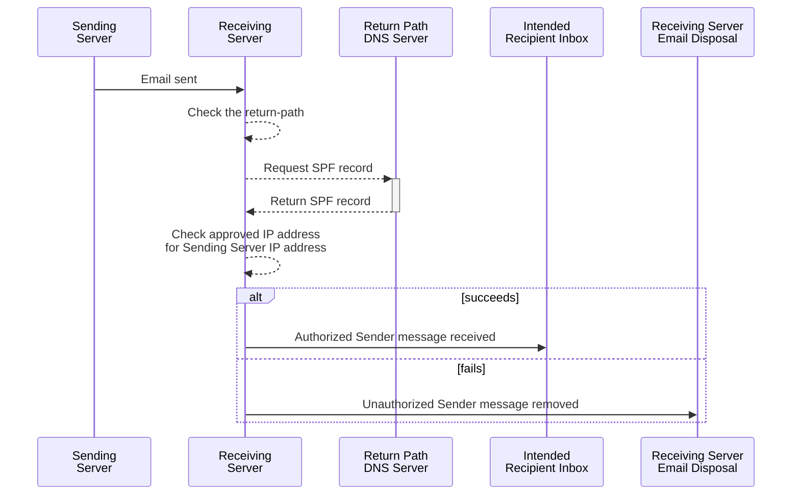

# Verify sending email servers with SPF

The *Sender Policy Framework* (SPF) lets domains authorize servers to send email on their behalf. Receiving hosts can confirm this authorization. SPF provides the first factor for [domain authentication][].

To activate SPF, a domain owner adds an SPF record as a [DNS][] [`TXT` record][TXT] on sending domain. This `TXT` record contains data on the IP addresses of email servers that can send email messages for the domain.

> \[!NOTE]
>
> The scope of SPF has limits. It doesn't verify content, [verify the message integrity][dkim], [verify the message sender, instruct the receiver how to route the message, or report failed checks][dmarc-p]. It verifies [sender identity][].

## Prerequisites

To add a SPF record to your domain requires familiarity with the follow concepts:

* [Domain Name System][dns] and DNS records, [TXT records][TXT] in particular
* [IP addresses][IP]

## Implement SPF

### Process flow for SPF on receiving email server

With SPF, receiving email servers check the domain of incoming email messages in the following process:

1. An email server receives an email message.
2. The receiving email server checks the message's `return-path`. The `return-path` is `sender@example.com`.
3. The receiving email server retrieves the SPF record from the DNS records for the `example.com` domain.
4. The receiving server asks the DNS server listed in the message's `return-path` header for its SPF record.
5. The receiving server compares the IP address of the sending server in the `return-path` header with the SPF record's list of authorized IP addresses.
6. If the SPF check passes, the receiving server accepts the message.
7. If the SPF check fails, the receiving server processes the message in a way consistent with the sending server's [DMARC][] policy, if known.



### Format of a SPF record in DNS

An SPF record resides as the value of a [DNS][] [`TXT` record][TXT] that resemble the following:

```text {title="Example of a SPF DNS TXT record"}
v=spf1 (<mechanism>[:<host or range>])... ~all
```

The `TXT` record value must adhere to the following standards:

* It must follow [RFC 1035][rfc1035] 3.3.14 format for DNS records.
* It can't exceed 512 bytes.
* All SPF record values start with `v=spf1`. This means that the value is an SPF version 1 record.
* The [*mechanism*][mechanisms] covers how the authorized IP address gets identified. Most times, this is a DNS record type. This can appear more than once.
* The *host or range* covers which host or hosts the domain authorized to send email. This is optional and can appear with additional mechanisms.
* The SPF record value ends with `~all` as a catchall for *no other hosts or servers*.

#### Mechanisms

The mechanisms define the which hosts can send email. These mechanisms can include one or more of the following items:

* an IP address
* an IP address range
* a DNS record type
* a domain
* a domain range
* a DNS query

These values resolve to one or more IP address authorized to send email on behalf of the domain.

| Mechanism | Description                                                                                            |
| --------- | ------------------------------------------------------------------------------------------------------ |
| `all`     | Matches all hosts. Put at the end of the SPF record.                                                   |
| `ip4`     | Matches all hosts with IPv4 addresses in the specified CIDR block.                                     |
| `ip6`     | Matches all hosts with IPv6 addresses in the specified CIDR block.                                     |
| `a`       | Matches all hosts in the domain with the specified `A` DNS record. Used for IPv4 addresses only.       |
| `aaaa`    | Matches all hosts in the domain with the specified `AAAA` DNS record. Used for IPv6 addresses only.    |
| `mx`      | Matches all hosts in the domain set as mail exchanger (`MX`) records.                                  |
| `ptr`     | Matches all hosts in the domain set as pointer (`PTR`) records.                                        |
| `exists`  | Perform an `A` query on the domain. Found results constitute matches.                                  |
| `include` | Search the domain for a match. If lookup doesn't match or returns an error, proceed to next mechanism. |

#### Modifiers

| Modifier            | Description                                                  |
| ------------------- | ------------------------------------------------------------ |
| `redirect=<domain>` | Use the domain specified instead of the current domain.      |
| `exp=<domain>`      | Send an explanation when a host doesn't match an IP address. |

#### Qualifiers

Hosts or ranges can have four qualifiers:

| Qualifier | Result    | Intention               | Explanation                                                                       |
| --------- | --------- | ----------------------- | --------------------------------------------------------------------------------- |
| `+`       | Pass      | Accept message          | SPF record indicates the host can send email                                      |
| `~`       | Soft Fail | Accept but mark message | SPF record indicates the host can't send email but is transitioning to that state |
| `-`       | Fail      | Reject message          | SPF record indicates the host can't send email                                    |
| `?`       | Neutral   | Accept message          | SPF record indicates explicitly that it has no position on the host's validity    |

#### Examples

A typical SPF record that allows Twilio SendGrid to send emails for your domain would look something like this:

```text
v=spf1 include:sendgrid.net -all
```

| Example                                   | Authorize only these hosts to send email                                               |
| ----------------------------------------- | -------------------------------------------------------------------------------------- |
| `v=spf1 mx ~all`                          | Allow all MX hosts in the domain.                                                      |
| `v=spf1 -all`                             | The domain can't send email.                                                           |
| `v=spf1 ip4:192.0.2.1/16 ~all`            | Allow any IPv4 address between `192.0.0.0` and `192.0.255.255`.                        |
| `v=spf1 ip4:192.0.2.1 ~all`               | Allow the IP addresses of `192.0.2.1`.                                                 |
| `v=spf1 ip6:1080::8:800:68.0.3.1/96 ~all` | Allow any IPv6 address between `1080::8:800:0000:0000` and `1080::8:800:FFFF:FFFF`.    |
| `v=spf1 a:example.com ~all`               | Allow any IPv4 address with an `A` record in the `example.com` domain.                 |
| `v=spf1 a ~all`                           | Allow any IPv4 address with an `A` record in the current domain                        |
| `v=spf1 aaaa:example.com ~all`            | Allow any IPv6 address and an `AAAA` record in the `example.com` domain.               |
| `v=spf1 mx mx:deferrals.example.com ~all` | Allow any IP address with an `MX` record plus another set of hosts used for deferrals. |
| `v=spf1 ptr ~all`                         | Allow any host in the domain.                                                          |
| `v=spf1 ptr:other.example.com ~all`       | Allow any host in the `other.example.com` domain.                                      |
| `v=spf1 exists:mx.example.com ~all`       | If the host resolves, allow it.                                                        |
| `v=spf1 include:_spf.example.com ~all`    | If the IP address can be found in the `example.com` domain, allow it.                  |

## SPF limitations

To resolve an SPF record, the SPF RFC limits the number of DNS lookups to 10. You can exceed this limit through the poor use of the `include` mechanism.

[RFC 7208][rfc7208], Section 4.6.4 "Processing Limits", specifies the following limitations:

> Some mechanisms and modifiers (collectively, "terms") cause DNS queries at the time of evaluation, and some do not. The following terms cause DNS queries: the "include", "a", "mx", "ptr", and "exists" mechanisms, and the "redirect" modifier. SPF implementations MUST limit the total number of those terms to 10 during SPF evaluation, to avoid unreasonable load on the DNS. If this limit is exceeded, the implementation MUST return "permerror". The other terms—the "all", "ip4", and "ip6" mechanisms, and the "exp" modifier—do not cause DNS queries at the time of SPF evaluation (the "exp" modifier only causes a lookup at a later time), and their use is not subject to this limit.

This limit prevents bad actors from using SPF lookups for Denial of Service attacks.

To avoid exceeding this limit, minimize the number of SPF mechanisms that need to resolve IP addresses. These include the `a`, `aaaa`, `mx`, `ptr`, `exists`, `include` mechanisms.

## Prevent SPF record validation issues

To avoid SPF validation issues related to DNS lookup limitations, optimize your SPF record. Consider the following best practices:

1. **Minimize `include` Mechanisms**: Reduce the use of the `include` mechanism to only include domains that are essential for your email delivery.
2. **Use IP Mechanisms**: Specify IP addresses directly with the `ip4` and `ip6` mechanisms as these mechanisms don't require DNS lookups.
3. **Monitor SPF Records**: Review and update your SPF record on a regular cadence. Keep it efficient and compliant with the SPF specification.
4. **Check your SPF Record**: To validate your SPF record, use the [SPF Record Check at MxToolbox][mxt-spf].

## Twilio SendGrid and SPF

To learn how Twilio SendGrid assists in SPF configuration, see [Configure domain authentication][].

## Related resources

* [Sender Identity][]
* [Domain Authentication][]
* [Single Sender Verification][]
* [DKIM Records Explained][]
* [How to Implement DMARC][]
* [SPF specification][]
* [Email spoofing][spoofing]

[Configure domain authentication]: /docs/sendgrid/ui/account-and-settings/how-to-set-up-domain-authentication

[DMARC]: /docs/sendgrid/glossary/dmarc

[spoofing]: /docs/sendgrid/glossary/spoofing

[TXT]: https://en.wikipedia.org/wiki/TXT_record

[DNS]: /docs/sendgrid/glossary/dns

[rfc1035]: https://datatracker.ietf.org/doc/html/rfc1035

[rfc7208]: https://datatracker.ietf.org/doc/html/rfc7208

[mechanisms]: https://en.wikipedia.org/wiki/Sender_Policy_Framework#Mechanisms

[mxt-spf]: https://mxtoolbox.com/spf.aspx

[Sender Identity]: /docs/sendgrid/for-developers/sending-email/sender-identity

[Domain Authentication]: /docs/sendgrid/ui/account-and-settings/how-to-set-up-domain-authentication

[Single Sender Verification]: /docs/sendgrid/ui/sending-email/sender-verification

[DKIM Records Explained]: /docs/sendgrid/ui/account-and-settings/dkim-records

[How to Implement DMARC]: /docs/sendgrid/ui/sending-email/how-to-implement-dmarc

[SPF specification]: http://www.open-spf.org

[dmarc-p]: /docs/sendgrid/ui/sending-email/dmarc

[dkim]: /docs/sendgrid/glossary/dkim

[IP]: /docs/sendgrid/glossary/ip-address
