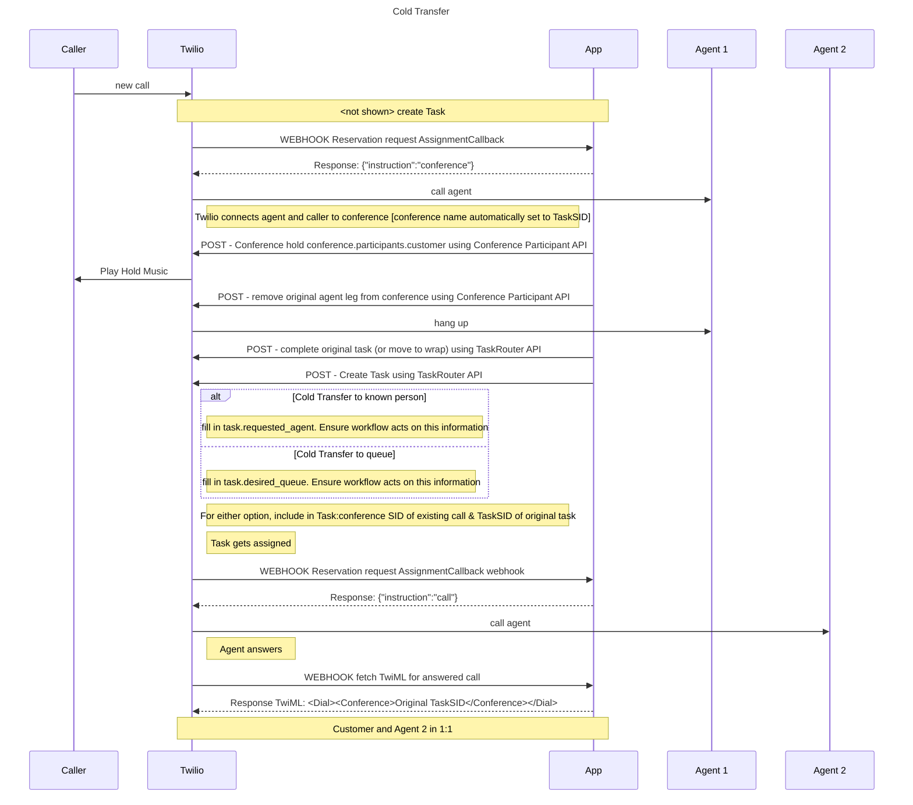
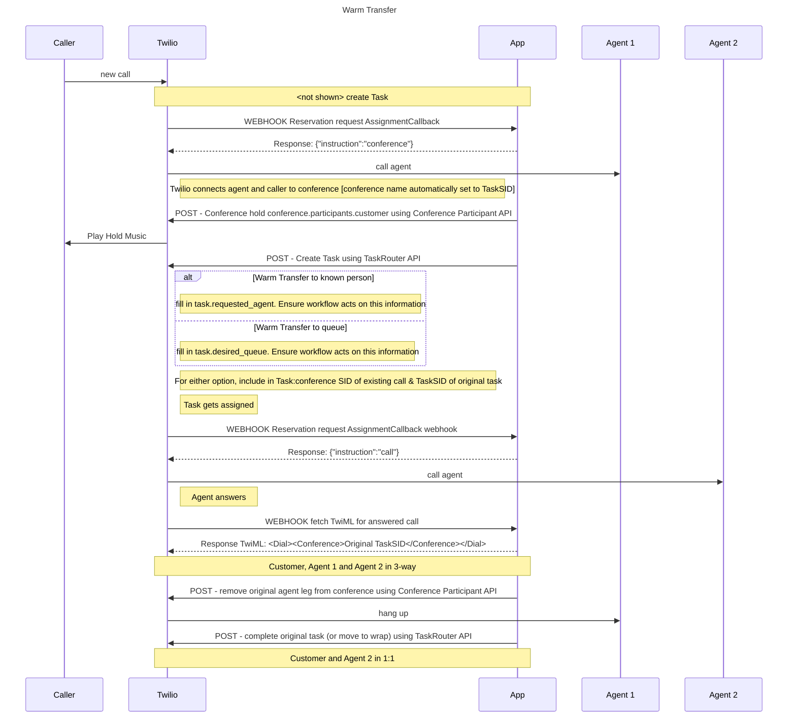

# Call Control Concepts

Twilio recommends that all calls between customer and agent (both inbound to agent and outbound from agent) be connected via a Twilio \<Conference> hub. Note that the name Conference can be misleading - think of Conference as the network media resource which allows your calls to be transferred, or do things like monitor, whisper, barge.

All Twilio contact center voice features are designed with Conference at the middle of the call topology. By adopting conference, as well as getting access to the features described below, you will also ensure your call topology is built in the right way to inherit future Twilio roadmap items.

This section covers the following areas:

* Call setup using a Conference bridge
* Putting caller on hold
* Cold Transfer (to a known person or to an unknown person in a specific queue)
* Warm Transfer (to a known person or to an unknown person in a specific queue)
* Supervisor Monitor mid-call
* Supervisor Whisper Mid-call
* Supervisor Barge-in mid-call
* Pre-call automated details whisper to agent

Note that while there are multiple ways to build these sorts of call flows, the recommendations here focus on using TaskRouter as part of each use case, in order to make sure that TaskRouter has full visibility of agent utilization, to ensure reporting/dashboard accuracy.

## Call setup using a Conference bridge

TaskRouter can take care of all the orchestration of connecting caller and agent via a conference bridge. This function does the following on your behalf:

* Connect agent into conference. The conference will be named by the TaskSID.
* Listen to callback that the agent has answered the call
* Move the caller from the queue and into the conference (note that this flow is optimized to ensure the media is routed locally for global deployments using Twilio Global Low Latency (GLL)).

To invoke this function, simply issue a 'conference' instruction to the reservation request, either through the TaskRouter JS SDK or as a response to the assignment callback. More details on TaskRouter conference instruction are available [here](/docs/taskrouter/api/reservations#conference).

Here's an example of a Task that has been through Conference Instruction:

```json
{
  "from_country": "GB",
  "conference": {
    "room_name":"WTa525c5b78f33f3c0ebba5f4572dd63bc",
    "sid":"CF9ae83ef32b28ccc25105f3273828952c",
    "participants":{
      "worker":"CA2bce114074e05093defe99446e54eaf2",
      "customer":"CA78598dbba985e38fb6d08e003a00563f"
    }
  },
  "called": "+447903546100",
  "to_country": "GB",
  "to_city": "",
  "to_state": "",
  "caller_country": "GB",
  "call_status": "in-progress",
  "call_sid": "CA78598dbba985e38fb6d08e003a00563f",
  "account_sid": "ACa157c7575370d480a640dd92889341cc",
  "from_zip": "",
  "from": "+447903543800",
  "direction": "inbound",
  "called_zip": "",
  "caller_state": "",
  "to_zip": "",
  "called_country": "GB",
  "from_city": "",
  "called_city": "",
  "caller_zip": "",
  "api_version": "2010-04-01",
  "called_state": "",
  "from_state": "",
  "caller": "+447903543800",
  "caller_city": "",
  "to": "+447903546100"
}
```

## Putting a call on hold

Putting a call on hold is easy provided you have already set the call up via a conference bridge as described above. To put the caller on hold, simply `POST` to the [Participants Resource](/docs/voice/api/conference-participant-resource).

```bash
curl 'https://api.twilio.com/2010-04-01/Accounts/<AccountSid>/Conferences/<Conference SID>/Participants/<Participant SID>.json' -X POST \
--data-urlencode 'Hold=true' \
--data-urlencode 'HoldUrl=www.myapp.com/hold' \
-u AC25e16e9a716a4a1786a7c83f58e30482:[AuthToken]
```

If you are using TaskRouter's conference instruction, all the SIDs you need will be within the Task Attributes.

* Conference SID will be the conference.sid from the Task Attributes, which your application will have access to client side
* Participant SID will be conference.participants.customer from the Task Attributes

The HoldUrl should provide the instructions for what hold music/announcement you want to play while the caller is on hold.

## Cold Call Transfer

A basic cold call transfer would involve:

* Put the caller on hold (as above)
* Add a participant to the conference (the target of the transfer)
* Remove the first agent CallSID from the conference
* In the cold call transfer scenario, it is not important for the addition of the new participant to be completed before the first agent call SID is removed. The conference and caller leg will stay up even if no one else is on the conference.

However, if you are investing in accurate reporting of your contact center deployment, you will probably want to use TaskRouter to deliver this transfer, in order to ensure accuracy of agent statistics.



## Warm Transfer

If doing a warm transfer using TaskRouter, the flow changes as follows



## Supervisor Monitor mid-call

You will need to connect your supervisor leg and once they answer respond with TwiML as follows:

```xml
<Response>
 <Dial>
   <Conference muted="true">TaskSID</Conference>
 </Dial>
</Response>
```

If you are using TaskRouter's conference instruction, the name of the conference you need to join will be the Task SID.

## Upgrading Monitor to Barge mid-call

For a supervisor to barge into a call from monitoring a call, simply update the supervisor call leg to turn muted off. See documentation [here](/docs/voice/api/conference-participant-resource)
